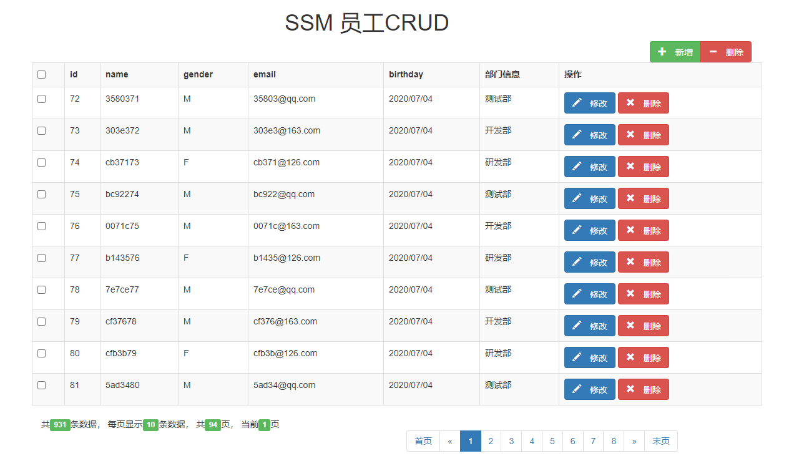
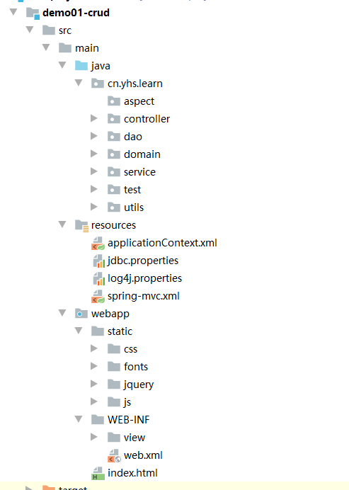
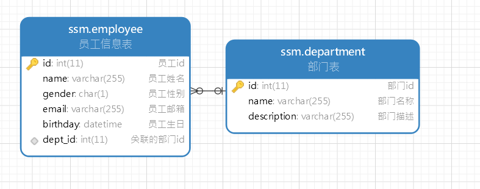

# 基本的员工操作-CRUD

# 一、项目说明

## 1. 项目介绍

基于员工业务的单页面的一套增、删、改、查操作，覆盖常用的操作。



## 2. 技术选型

|             |          |            |                  |
| :---------- | :------- | :--------- | :--------------- |
| 技术栈      | 前端技术 | 服务端技术 | 说明             |
| JDK         |          | ✔          | Java基础开发环境 |
| Spring      |          | ✔          | IoC和AOP容器框架 |
| SpringMVC   |          | ✔          | Web框架          |
| Mybatis     |          | ✔          | 持久层框架       |
| MySQL       |          | ✔          | MySQL数据库      |
| PageHelper  |          | ✔          | 分页插件         |
| Maven       |          | ✔          | 项目管理工具     |
| Jackson     |          | ✔          | JSON转换工具     |
| Lombok      |          | ✔          | 提供注解简化编程 |
| Druid       |          | ✔          | 数据库连接池     |
| jQuery      | ✔        |            | JS库             |
| Bootstrap   | ✔        |            | UI 框架          |
| 持续更新... | ...      | ...        |                  |

## 3. 项目特点

- 基于全新的Spring 、Mybatis、SpringMVC等主流框架高度整合，提供稳定、高效、基础架构。
- 采用主流的Bootstrap等前端模版框架，上手简单、美观大气、交互体验更完美。
- Maven多模块管理，组件独立且共享，可快速拼装，按需增减。真正解耦合，提高效率。

## 4. 功能介绍

- 前后端交互都是通过AJAX发送请求，JSON进行数据交互，前端后分离，降低耦合性，提高扩展性。

- 员工增加（前端JS校验+后端JSR303校验），双重校验，保证数据的安全性，规范性。
- 员工更新（前端JS校验+后端JSR303校验），双重校验，保证数据的安全性，规范性。
- 员工查询（分页查询，分页信息、全展示，），交互性好，操作性强。
- 用工删除（单个删除，全选删除）。

## 5. 开发规范

### 5.1 类约定

实现单个对象包含但不限于以下文件，如下：

| 层次   | 文件名                                 |
| :----- | :------------------------------------- |
| 视图层 | demo.html                              |
| 控制器 | DemoController.java                    |
| 服务层 | DemoService.java、DemoServiceImpl.java |
| 映射层 | DemoMapper.java、DemoMapper.xml        |
| 模型层 | Demo.java、DemoVo.java                 |

### 5.2 方法约定

每个对象均具备以下公约方法：

- find 列表查询
- save新增对象
- delete 删除对象
- update 更新对象

### 5.3 API响应报文格式约定

采用主流JSON格式，统一返回`BaseResultData`对象格式

```json
{
	"code": 0, 返回错误码 0表示成功
	"count": 0, 返回总条数
	"data": {}, 返回对象/数据列表
	"msg": "成功" 返回详细描述 
}
```

### 5.3 数据库字段

```sql
CREATE TABLE `employee` (
  `id` int(11) NOT NULL AUTO_INCREMENT COMMENT '员工id',
  `name` varchar(255) NOT NULL COMMENT '员工姓名',
  `gender` char(1) NOT NULL COMMENT '员工性别',
  `email` varchar(255) DEFAULT NULL COMMENT '员工邮箱',
  `birthday` datetime DEFAULT NULL COMMENT '员工生日',
  `dept_id` int(11) DEFAULT NULL COMMENT '关联的部门id',
  PRIMARY KEY (`id`),
  KEY `fk_dept_id` (`dept_id`),
  CONSTRAINT `fk_dept_id` FOREIGN KEY (`dept_id`) REFERENCES `department` (`id`)
) ENGINE=InnoDB AUTO_INCREMENT=1017 DEFAULT CHARSET=utf8 COMMENT='员工信息表';
```

- 字段全部小写
- 多个字段采用“_”分割
- 表、字段都要加注释

# 二、项目开发

## 1. 构建maven web工程，导入依赖

```xml
<?xml version="1.0" encoding="UTF-8"?>

<project xmlns="http://maven.apache.org/POM/4.0.0" xmlns:xsi="http://www.w3.org/2001/XMLSchema-instance"
         xsi:schemaLocation="http://maven.apache.org/POM/4.0.0 http://maven.apache.org/xsd/maven-4.0.0.xsd">
    <modelVersion>4.0.0</modelVersion>
    <groupId>cn.yhs.learn</groupId>
    <artifactId>demo01-crud</artifactId>
    <version>1.0-SNAPSHOT</version>
    <packaging>war</packaging>
    <name>demo01-crud</name>
    <!--========================== 版本控制 ========================-->
    <properties>
        <project.build.sourceEncoding>UTF-8</project.build.sourceEncoding>
        <maven.compiler.source>1.8</maven.compiler.source>
        <maven.compiler.target>1.8</maven.compiler.target>
        <!--spring版本-->
        <spring.version>5.0.8.RELEASE</spring.version>
        <!--druid版本-->
        <druid.version>1.1.10</druid.version>
        <!--MySQL版本-->
        <mysql.version>5.1.47</mysql.version>
        <!--MyBatis版本-->
        <mybatis.version>3.4.6</mybatis.version>
        <!--MyBatis整合Spring的版本-->
        <mybatis.spring.version>1.3.2</mybatis.spring.version>
        <!--分页插件版本-->
        <pagehelper.version>5.1.8</pagehelper.version>
        <!--junit版本-->
        <junit.version>4.12</junit.version>
        <!--Lombok版本-->
        <lombok.version>1.18.8</lombok.version>
        <!--jackson版本-->
        <jackson.version>2.10.0</jackson.version>
        <!--slf4j版本-->
        <slf4j.version>1.7.25</slf4j.version>
        <!--log4j版本-->
        <log4j.version>1.2.17</log4j.version>
        <!--JSR303版本-->
        <hibernate.validator.version>5.4.1.Final</hibernate.validator.version>
    </properties>
    <!--============================== 依赖控制 ==============================-->
    <dependencies>
        <!--===================================== Web Start ================================-->
        <!--jstl-->
        <dependency>
            <groupId>javax.servlet</groupId>
            <artifactId>jstl</artifactId>
            <version>1.2</version>
        </dependency>
        <!--servlet-->
        <dependency>
            <groupId>javax.servlet</groupId>
            <artifactId>javax.servlet-api</artifactId>
            <version>3.1.0</version>
            <scope>provided</scope>
        </dependency>
        <!--webmvc-->
        <dependency>
            <groupId>org.springframework</groupId>
            <artifactId>spring-webmvc</artifactId>
            <version>${spring.version}</version>
        </dependency>
        <!--===================================== Web End ===================================-->
        <!--===================================== Service Start =============================-->
        <!--切面编程-->
        <dependency>
            <groupId>org.springframework</groupId>
            <artifactId>spring-aspects</artifactId>
            <version>${spring.version}</version>
        </dependency>
        <!--事务管理-->
        <dependency>
            <groupId>org.springframework</groupId>
            <artifactId>spring-jdbc</artifactId>
            <version>${spring.version}</version>
        </dependency>
        <!--===================================== Service End ===============================-->
        <!--===================================== Dao Start =================================-->
        <!--Druid数据源-->
        <dependency>
            <groupId>com.alibaba</groupId>
            <artifactId>druid</artifactId>
            <version>${druid.version}</version>
        </dependency>
        <!--MySQL-->
        <dependency>
            <groupId>mysql</groupId>
            <artifactId>mysql-connector-java</artifactId>
            <version>${mysql.version}</version>
        </dependency>
        <!--MyBatis-->
        <dependency>
            <groupId>org.mybatis</groupId>
            <artifactId>mybatis</artifactId>
            <version>${mybatis.version}</version>
        </dependency>
        <!--分页插件-->
        <dependency>
            <groupId>com.github.pagehelper</groupId>
            <artifactId>pagehelper</artifactId>
            <version>${pagehelper.version}</version>
        </dependency>
        <!--===================================== Dao End ===================================-->
        <!--===================================== Utils Start ===============================-->
        <!--junit单元测试-->
        <dependency>
            <groupId>junit</groupId>
            <artifactId>junit</artifactId>
            <version>${junit.version}</version>
            <!--  <scope>test</scope>-->
        </dependency>
        <!--lombok-->
        <dependency>
            <groupId>org.projectlombok</groupId>
            <artifactId>lombok</artifactId>
            <version>${lombok.version}</version>
            <scope>provided</scope>
        </dependency>
        <!--jackson-->
        <dependency>
            <groupId>com.fasterxml.jackson.core</groupId>
            <artifactId>jackson-databind</artifactId>
            <version>${jackson.version}</version>
        </dependency>
        <!--log4j的jar包-->
        <!--一定要把log4j日志的放在前面，让它先加载，这样就能显示日志信息了-->
        <dependency>
            <groupId>log4j</groupId>
            <artifactId>log4j</artifactId>
            <version>${log4j.version}</version>
        </dependency>
        <!--日志门面-->
        <!-- https://mvnrepository.com/artifact/org.slf4j/slf4j-api -->
        <dependency>
            <groupId>org.slf4j</groupId>
            <artifactId>slf4j-api</artifactId>
            <version>${slf4j.version}</version>
        </dependency>
        <!--绑定log4j需要绑定适配器-->
        <dependency>
            <groupId>org.slf4j</groupId>
            <artifactId>slf4j-log4j12</artifactId>
            <version>${slf4j.version}</version>
        </dependency>

        <!--JSR303数据校验-->
        <dependency>
            <groupId>org.hibernate</groupId>
            <artifactId>hibernate-validator</artifactId>
            <version>${hibernate.validator.version}</version>
        </dependency>
        <!--===================================== Utils End =================================-->
        <!--===================================== 整合 Start =================================-->
        <!--spring和Junit的整合, SpringJUnit4ClassRunner requires JUnit 4.12 or higher.-->
        <dependency>
            <groupId>org.springframework</groupId>
            <artifactId>spring-test</artifactId>
            <version>${spring.version}</version>
            <!--<scope>test</scope> -->
            <scope>compile</scope>
        </dependency>
        <!--spring和MyBatis的整合-->
        <dependency>
            <groupId>org.mybatis</groupId>
            <artifactId>mybatis-spring</artifactId>
            <version>${mybatis.spring.version}</version>
        </dependency>
        <!--===================================== 整合 End =================================-->
    </dependencies>


</project>

```

## 2. 项目结构



## 3. 配置文件

### 3.1 applicationContext.xml

```xml
<?xml version="1.0" encoding="UTF-8"?>
<beans xmlns="http://www.springframework.org/schema/beans"
       xmlns:xsi="http://www.w3.org/2001/XMLSchema-instance"
       xmlns:context="http://www.springframework.org/schema/context" xmlns:tx="http://www.springframework.org/schema/tx"
       xmlns:aop="http://www.springframework.org/schema/aop"
       xsi:schemaLocation="http://www.springframework.org/schema/beans http://www.springframework.org/schema/beans/spring-beans.xsd http://www.springframework.org/schema/context http://www.springframework.org/schema/context/spring-context.xsd http://www.springframework.org/schema/tx http://www.springframework.org/schema/tx/spring-tx.xsd http://www.springframework.org/schema/aop http://www.springframework.org/schema/aop/spring-aop.xsd">
    <!--Spring容器的配置文件-->
    <!--1. 配置基本包的扫描，排除@Controller注解的类-->
    <context:component-scan base-package="cn.yhs.learn">
        <context:include-filter type="annotation" expression="org.springframework.stereotype.Controller"/>
    </context:component-scan>
    <!--2.配置数据源-->
    <!--============================== Dao Start ================================-->
    <context:property-placeholder location="classpath:jdbc.properties"/>
    <bean class="com.alibaba.druid.pool.DruidDataSource" id="dataSource" init-method="init" destroy-method="close">
        <property name="driverClassName" value="${druid.jdbc.driverClassName}"/>
        <property name="url" value="${druid.jdbc.url}"/>
        <property name="username" value="${druid.jdbc.username}"/>
        <property name="password" value="${druid.jdbc.password}"/>
        <property name="initialSize" value="${druid.jdbc.initialSize}"/>
        <property name="maxActive" value="${druid.jdbc.maxActive}"/>
        <property name="maxWait" value="${druid.jdbc.maxWait}"/>
    </bean>	
    <!--3.配置SqlSessionFactory-->
    <bean class="org.mybatis.spring.SqlSessionFactoryBean" id="sqlSessionFactory">
        <property name="dataSource" ref="dataSource"/>
        <!--3.1使用插件的方式配置分页工具-->
        <property name="plugins">
            <array>
                <bean class="com.github.pagehelper.PageInterceptor" id="pageInterceptor">
                    <property name="properties">
                        <!--使用下面的方式配置参数，一行配置一个 -->
                        <value>
                            helperDialect=mysql
                            reasonable=true
                        </value>
                    </property>
                </bean>
            </array>
        </property>
    </bean>
    <!--4.配置批量操作的sqlSessionTemplate-->
    <bean id="sqlSessionTemplate" class="org.mybatis.spring.SqlSessionTemplate">
        <constructor-arg name="sqlSessionFactory" ref="sqlSessionFactory"/>
        <constructor-arg name="executorType" value="BATCH"/>
    </bean>
    <!--5.配置dao扫描-->
    <bean class="org.mybatis.spring.mapper.MapperScannerConfigurer" id="mapperScannerConfigurer">
        <property name="basePackage" value="cn.yhs.learn.dao"/>
    </bean>
    <!--============================== Dao End ================================-->
    <!--============================== Service Start ================================-->
    <!--5.配置数据源事务管理器-->
    <bean class="org.springframework.jdbc.datasource.DataSourceTransactionManager" id="transactionManager">
        <property name="dataSource" ref="dataSource"/>
    </bean>
    <!--6. 配置声明式事务,可以使用xml配置，可以使用注解-->
    <tx:advice transaction-manager="transactionManager" id="txAdvice">
        <tx:attributes>
            <tx:method name="find*" read-only="true"/>
            <tx:method name="*"/>
        </tx:attributes>
    </tx:advice>
    <!--7. 使用切面的方式进行事务控制-->
    <aop:config>
        <aop:pointcut id="pt1" expression="execution(* cn.yhs.learn.service.*.*(..))"/>
        <aop:advisor advice-ref="txAdvice" pointcut-ref="pt1"/>
    </aop:config>
    <!--============================== Service End ================================-->
</beans>
```

### 3.2 spring-mvc.xml

```xml
<?xml version="1.0" encoding="UTF-8"?>
<beans xmlns="http://www.springframework.org/schema/beans"
       xmlns:xsi="http://www.w3.org/2001/XMLSchema-instance"
       xmlns:context="http://www.springframework.org/schema/context"
       xmlns:mvc="http://www.springframework.org/schema/mvc"
       xsi:schemaLocation="http://www.springframework.org/schema/beans http://www.springframework.org/schema/beans/spring-beans.xsd http://www.springframework.org/schema/context http://www.springframework.org/schema/context/spring-context.xsd http://www.springframework.org/schema/mvc http://www.springframework.org/schema/mvc/spring-mvc.xsd">
    <!--spring webmvc的配置文件-->
    <!--1.配置基本包的扫描,只扫描带有@Controller的注解-->
    <context:component-scan base-package="cn.yhs.learn" use-default-filters="false">
        <context:include-filter type="annotation" expression="org.springframework.stereotype.Controller"/>
    </context:component-scan>
    <!--2.配置视图解析器-->
    <bean class="org.springframework.web.servlet.view.InternalResourceViewResolver" id="viewResolver">
        <property name="prefix" value="/WEB-INF/view/"/>
        <property name="suffix" value=".jsp"/>
    </bean>
    <!--3.spring web处理不了资源，交给Tomcat处理(过滤静态资源)-->
    <mvc:default-servlet-handler/>
    <!--4.开启注解支持-->
    <mvc:annotation-driven/>
</beans>
```

### 3.3 jdbc.properties

```properties
# druid 的配置文件
druid.jdbc.driverClassName=com.mysql.jdbc.Driver
druid.jdbc.url=jdbc:mysql:///ssm
druid.jdbc.username=root
druid.jdbc.password=123456
druid.jdbc.maxWait=2000
druid.jdbc.initialSize=10
druid.jdbc.maxActive=10
```

### 3.4 log4j.properties

```properties
# Set root category priority to INFO and its only appender to CONSOLE.
#log4j.rootCategory=INFO, CONSOLE            debug   info   warn error fatal
#log4j.rootCategory=debug, CONSOLE, LOGFILE

#log4j.rootCategory=debug, CONSOLE
log4j.rootCategory=info, CONSOLE
# Set the enterprise logger category to FATAL and its only appender to CONSOLE.
# log4j.logger.org.apache.axis.enterprise=FATAL, CONSOLE
# CONSOLE is set to be a ConsoleAppender using a PatternLayout.
log4j.appender.CONSOLE=org.apache.log4j.ConsoleAppender
log4j.appender.CONSOLE.layout=org.apache.log4j.PatternLayout
log4j.appender.CONSOLE.layout.ConversionPattern=%d{ISO8601} %-6r [%15.15t] %-5p %30.30c %x - %m\n
# LOGFILE is set to be a File appender using a PatternLayout.
# log4j.appender.LOGFILE=org.apache.log4j.FileAppender
# log4j.appender.LOGFILE.File=d:\axis.log
# log4j.appender.LOGFILE.Append=true
# log4j.appender.LOGFILE.layout=org.apache.log4j.PatternLayout
# log4j.appender.LOGFILE.layout.ConversionPattern=%d{ISO8601} %-6r [%15.15t] %-5p %30.30c %x - %m\n

```

### 3.5 web.xml

```xml
<!DOCTYPE web-app PUBLIC
 "-//Sun Microsystems, Inc.//DTD Web Application 2.3//EN"
 "http://java.sun.com/dtd/web-app_2_3.dtd" >

<web-app>
  <display-name>Archetype Created Web Application</display-name>
  <!-- 1.容器初始化参数，ContextLoadListener监听器创建的时候就会加载参数-->
  <context-param>
    <param-name>contextConfigLocation</param-name>
    <param-value>classpath:applicationContext.xml</param-value>
  </context-param>

  <!-- 2. 配置POST方式编码-->
  <filter>
    <filter-name>characterEncodingFilter</filter-name>
    <filter-class>org.springframework.web.filter.CharacterEncodingFilter</filter-class>
    <init-param>
      <param-name>encoding</param-name>
      <param-value>UTF-8</param-value>
    </init-param>
    <init-param>
      <param-name>forceEncoding</param-name>
      <param-value>true</param-value>
    </init-param>
  </filter>

  <!-- 3. 发送PUT和DELETE请求.-->
  <!--form表单直接使用method="POST"的方式提交，提交一个隐藏的input  <input type="hidden" name="_method" value="put" />-->
  <filter>
    <filter-name>httpMethodFilter</filter-name>
    <filter-class>org.springframework.web.filter.HiddenHttpMethodFilter</filter-class>
  </filter>
  <!--2.1 拦截所有请求，在所有过滤器的前面-->
  <filter-mapping>
    <filter-name>characterEncodingFilter</filter-name>
    <url-pattern>/*</url-pattern>
  </filter-mapping>

  <!--3.1 拦截改变请求方式-->
  <filter-mapping>
    <filter-name>httpMethodFilter</filter-name>
    <url-pattern>/*</url-pattern>
  </filter-mapping>

  <!--4. 配置Web监听器，通过第1步配置的容器参数创建spring ioc 容器-->
  <listener>
    <listener-class>org.springframework.web.context.ContextLoaderListener</listener-class>
  </listener>

  <!-- 5. 配置前端控制转发器，并创建Spring webmvc 容器-->
  <servlet>
    <servlet-name>dispatcherServlet</servlet-name>
    <servlet-class>org.springframework.web.servlet.DispatcherServlet</servlet-class>
    <init-param>
      <param-name>contextConfigLocation</param-name>
      <param-value>classpath:spring-mvc.xml</param-value>
    </init-param>
    <!--5.1改变启动顺序，tomcat启动的时候就创建-->
    <load-on-startup>1</load-on-startup>
  </servlet>
  <servlet-mapping>
    <servlet-name>dispatcherServlet</servlet-name>
    <url-pattern>/</url-pattern>
  </servlet-mapping>

  <!-- 6. 配置首页-->
  <welcome-file-list>
    <welcome-file>index.jsp</welcome-file>
    <welcome-file>index.html</welcome-file>
  </welcome-file-list>
</web-app>
```

## 4. 数据库建表语句



### 4.1 员工表

```sql
CREATE TABLE `employee` (
  `id` int(11) NOT NULL AUTO_INCREMENT COMMENT '员工id',
  `name` varchar(255) NOT NULL COMMENT '员工姓名',
  `gender` char(1) NOT NULL COMMENT '员工性别',
  `email` varchar(255) DEFAULT NULL COMMENT '员工邮箱',
  `birthday` datetime DEFAULT NULL COMMENT '员工生日',
  `dept_id` int(11) DEFAULT NULL COMMENT '关联的部门id',
  PRIMARY KEY (`id`),
  KEY `fk_dept_id` (`dept_id`),
  CONSTRAINT `fk_dept_id` FOREIGN KEY (`dept_id`) REFERENCES `department` (`id`)
) ENGINE=InnoDB AUTO_INCREMENT=1017 DEFAULT CHARSET=utf8 COMMENT='员工信息表';
```

### 4.2 部门表

```sql
CREATE TABLE `department` (
  `id` int(11) NOT NULL AUTO_INCREMENT COMMENT '部门id',
  `name` varchar(255) NOT NULL COMMENT '部门名称',
  `description` varchar(255) DEFAULT NULL COMMENT '部门描述',
  PRIMARY KEY (`id`)
) ENGINE=InnoDB AUTO_INCREMENT=4 DEFAULT CHARSET=utf8 COMMENT='部门表';
```

## 5. domain层

### **5.0 Lombok 插件说明**

Lombok的作用是能够达到的效果就是在源码中不需要写一些通用的方法，但是在编译生成的字节码文件中会帮我们生成这些方法，使用Lombok的好处使代码更简洁，更优雅。

### 5.1 Employee

```java
package cn.yhs.learn.domain;

import cn.yhs.learn.utils.DateUtils;
import lombok.AllArgsConstructor;
import lombok.Data;
import lombok.NoArgsConstructor;
import org.hibernate.validator.constraints.NotEmpty;
import javax.validation.constraints.Past;
import javax.validation.constraints.Pattern;
import java.util.Date;

/**
 * @ProjectName: ssm-project
 * @Name: cn.yhs.learn.domain.Employee
 * @Author: Splendor -- 加油,你是最棒的 ~_~
 * @Email: 15617577080@163.com
 * @Time: 2020/7/4 11:53
 * @Description: 数据库对应的实体类 Employee
 **/
@AllArgsConstructor
@NoArgsConstructor
@Data
public class Employee {
    private Integer id;
    // JSR 303的注解校验，字段非空
    @NotEmpty
    private String name;
    private Character gender;
    // 邮箱正则表达式
    @Pattern(regexp = "^([a-z0-9_\\.-]+)@([\\da-z\\.-]+)\\.([a-z\\.]{2,6})$", message = "邮箱格式不合法")
    private String email;
    // 日期必须是之前的日期
    @Past(message = "日期必须是之前的日期")
    private Date birthday;
    private String birthdayStr;
    // 部门id
    private Integer deptId;
    // 1个员工只能属于一个部门
    private Department department;

    public Employee(Integer id, String name, Character gender, String email, Date birthday, Integer deptId) {
        this.id = id;
        this.name = name;
        this.gender = gender;
        this.email = email;
        this.birthday = birthday;
        this.deptId = deptId;
    }

    public Employee(Integer id, String name, Character gender, String email, Date birthday, Integer deptId, Department department) {
        this.id = id;
        this.name = name;
        this.gender = gender;
        this.email = email;
        this.birthday = birthday;
        this.deptId = deptId;
        this.department = department;
    }

    public String getBirthdayStr() {
        return DateUtils.date2String(this.birthday);
    }
}
```

### 5.2 Department

```java
package cn.yhs.learn.domain;

import lombok.AllArgsConstructor;
import lombok.Data;
import lombok.NoArgsConstructor;

/**
 * @ProjectName: ssm-project
 * @Name: cn.yhs.learn.domain.Department
 * @Author: Splendor -- 加油,你是最棒的 ~_~
 * @Email: 15617577080@163.com
 * @Time: 2020/7/4 14:44
 * @Description: 部门实体类
 **/
@AllArgsConstructor
@NoArgsConstructor
@Data
public class Department {
    private Integer id;
    private String name;
    private String description;
}
```

### 5.3 ResultData 统一API返回结果

```java
package cn.yhs.learn.domain;

import lombok.AllArgsConstructor;
import lombok.Data;
import lombok.NoArgsConstructor;

/**
 * @ProjectName: ssm-project
 * @Name: cn.yhs.learn.domain.ResultData
 * @Author: Splendor -- 加油,你是最棒的 ~_~
 * @Email: 15617577080@163.com
 * @Time: 2020/7/6 12:10
 * @Description: 通用的返回数据类型
 * {
 * "code": 0, 返回错误码 0表示成功
 * "count": 0, 返回总条数
 * "data": {}, 返回对象/数据列表
 * "msg": "成功" 返回详细描述
 * }
 **/
@Data
@NoArgsConstructor
@AllArgsConstructor
public class ResultData {
    // 响应的业务状态码
    private Integer code;
    // 响应的业务数据总条数
    private Long count;
    // 响应消息
    private String msg;
    // 响应的数据
    private Object data;


    // 成功
    public static ResultData SUCCESS(Integer code, Long count, String msg, Object data) {
        ResultData resultData = new ResultData();
        resultData.setCode(code);
        resultData.setCount(count);
        resultData.setMsg(msg);
        resultData.setData(data);
        return resultData;
    }

    public static ResultData SUCCESS(Long count, String msg, Object data) {
        return FAIL(200, count, msg, data);
    }

    public static ResultData SUCCESS(String msg, Object data) {
        return FAIL(200, 1L, msg, data);
    }

    public static ResultData SUCCESS(Object data) {
        return FAIL(200, 1L, "成功", data);
    }

    public static ResultData SUCCESS() {
        return FAIL(200, 1L, "成功", null);
    }


    // 失败
    public static ResultData FAIL(Integer code, Long count, String msg, Object data) {
        ResultData resultData = new ResultData();
        resultData.setCode(code);
        resultData.setCount(count);
        resultData.setMsg(msg);
        resultData.setData(data);
        return resultData;
    }

    public static ResultData FAIL(Long count, String msg, Object data) {
        return FAIL(100, count, msg, data);
    }

    public static ResultData FAIL(String msg, Object data) {
        return FAIL(100, 0L, msg, data);
    }

    public static ResultData FAIL(Object data) {
        return FAIL(100, 0L, "失败", data);
    }

    // 100 是失败的状态
    public static ResultData FAIL() {
        return FAIL(100, 0L, "失败", null);
    }
}
```

## 6. dao层

dao层统一使用注解的形式操作数据库

### 6.1 DepartmentDao

```java
package cn.yhs.learn.dao;

import cn.yhs.learn.domain.Department;
import org.apache.ibatis.annotations.Insert;
import org.apache.ibatis.annotations.Select;
import org.springframework.stereotype.Repository;

import java.util.List;

/**
 * @ProjectName: ssm-project
 * @Name: cn.yhs.learn.dao.DepartmentDao
 * @Author: Splendor -- 加油,你是最棒的 ~_~
 * @Email: 15617577080@163.com
 * @Time: 2020/7/4 14:46
 * @Description: 部门dao
 **/
@Repository
public interface DepartmentDao {

    // 踩坑1：不要用mysql的关键字做字段，不要会出问题 desc => description
    @Insert("insert into department(name,description) value(#{name},#{description})")
    void save(Department department);

    @Select("select * from department where id = #{deptId}")
    Department findByDeptId(Integer deptId);

    @Select("select * from department")
    List<Department> findAll();
}

```

### 6.2 EmployeeDao

涉及到1对1的查询

```java
package cn.yhs.learn.dao;

import cn.yhs.learn.domain.Employee;
import org.apache.ibatis.annotations.*;
import org.springframework.stereotype.Repository;

import java.util.List;

/**
 * @ProjectName: ssm-project
 * @Name: cn.yhs.learn.dao.EmployeeDao
 * @Author: Splendor -- 加油,你是最棒的 ~_~
 * @Email: 15617577080@163.com
 * @Time: 2020/7/4 14:48
 * @Description: todo
 **/
@Repository
public interface EmployeeDao {
    /**
     * 插入一个员工不带部门信息的
     *
     * @param employee
     */
    @Insert("insert into employee (name,gender,email,birthday,dept_id) value (#{name},#{gender},#{email},#{birthday},#{deptId})")
    void save(Employee employee);


    @Select("select * from employee")
    @Results(id = "empWithDept", value = {
            @Result(id = true, column = "id", property = "id"),
            @Result(column = "dept_id", property = "deptId"),
            @Result(column = "dept_id", property = "department", one = @One(select = "cn.yhs.learn.dao.DepartmentDao.findByDeptId"))
    })
    List<Employee> findAll();

    @Select("select * from employee where id = #{empId}")
    @ResultMap("empWithDept")
    Employee findByEmpId(Integer empId);

    @Update("update employee set name =#{name},gender = #{gender},email = #{email},birthday = #{birthday},dept_id = #{deptId} where id = #{id}")
    void updateEmp(Employee employee);

    @Delete("delete from employee where id = #{empId}")
    void deleteEmpById(Integer empId);
}

```

## 7. service层

通过声明式事务来控制整个系统的事务管理

### 7.1 DepartmentServiceImpl

```java
package cn.yhs.learn.service.impl;

import cn.yhs.learn.dao.DepartmentDao;
import cn.yhs.learn.domain.Department;
import cn.yhs.learn.service.DepartmentService;
import org.springframework.beans.factory.annotation.Autowired;
import org.springframework.stereotype.Service;

import java.util.List;

/**
 * @ProjectName: ssm-project
 * @Name: cn.yhs.learn.service.impl.DepartmentServiceImpl
 * @Author: Splendor -- 加油,你是最棒的 ~_~
 * @Email: 15617577080@163.com
 * @Time: 2020/7/6 15:47
 * @Description: todo
 **/
@Service
public class DepartmentServiceImpl implements DepartmentService {
    @Autowired
    private DepartmentDao departmentDao;

    @Override
    public List<Department> findAll() {
        return departmentDao.findAll();
    }
}

```

### 7.2 EmployeeServiceImpl

设计到的批量删除是一个重点

```java
package cn.yhs.learn.service.impl;

import cn.yhs.learn.dao.EmployeeDao;
import cn.yhs.learn.domain.Employee;
import cn.yhs.learn.service.EmployeeService;
import org.mybatis.spring.SqlSessionTemplate;
import org.springframework.beans.factory.annotation.Autowired;
import org.springframework.stereotype.Service;

import java.util.List;

/**
 * @ProjectName: ssm-project
 * @Name: cn.yhs.learn.service.impl.EmployeeServiceImpl
 * @Author: Splendor -- 加油,你是最棒的 ~_~
 * @Email: 15617577080@163.com
 * @Time: 2020/7/4 15:03
 * @Description: todo
 **/
@Service
public class EmployeeServiceImpl implements EmployeeService {
    @Autowired
    private EmployeeDao employeeDao;
    // 用于批量删除的session
    @Autowired
    private SqlSessionTemplate sqlSessionTemplate;

    @Override
    public void save(Employee employee) {
        employeeDao.save(employee);
    }

    @Override
    public List<Employee> findAll() {
        return employeeDao.findAll();
    }

    @Override
    public Employee findByEmpId(Integer empId) {
        return employeeDao.findByEmpId(empId);
    }

    @Override
    public void updateEmp(Employee employee) {
        employeeDao.updateEmp(employee);
    }

    @Override
    public void deleteEmpById(Integer empId) {
        employeeDao.deleteEmpById(empId);
    }

    @Override
    public void deleteAllIds(Integer[] ids) {
        // 批量删除
        EmployeeDao employeeDao = sqlSessionTemplate.getMapper(EmployeeDao.class);
        for (Integer id : ids) {
            employeeDao.deleteEmpById(id);
        }
    }
}

```

## 8. controller层

### 8.1 EmployeeController

```java
package cn.yhs.learn.controller;

import cn.yhs.learn.domain.Employee;
import cn.yhs.learn.domain.ResultData;
import cn.yhs.learn.service.EmployeeService;
import com.github.pagehelper.PageHelper;
import com.github.pagehelper.PageInfo;
import lombok.extern.slf4j.Slf4j;
import org.springframework.beans.factory.annotation.Autowired;
import org.springframework.stereotype.Controller;
import org.springframework.validation.BindingResult;
import org.springframework.validation.FieldError;
import org.springframework.validation.annotation.Validated;
import org.springframework.web.bind.annotation.*;

import java.util.Arrays;
import java.util.HashMap;
import java.util.List;
import java.util.Map;

/**
 * @ProjectName: ssm-project
 * @Name: cn.yhs.learn.controller.EmployeeController
 * @Author: Splendor -- 加油,你是最棒的 ~_~
 * @Email: 15617577080@163.com
 * @Time: 2020/7/5 7:59
 * @Description: todo
 **/
@Controller
@RequestMapping("/emp")
@Slf4j
public class EmployeeController {

    @Autowired
    private EmployeeService employeeService;

    /**
     * 分页查询所有员工
     *
     * @param pageNum
     * @param pageSize
     * @return
     */
    @ResponseBody
    @RequestMapping("/findAll")
    public ResultData findAllEmp(@RequestParam(required = false, defaultValue = "1") Integer pageNum,
                                 @RequestParam(required = false, defaultValue = "10") Integer pageSize) {
        // 1. 使用分页插件进行分页切入
        PageHelper.startPage(pageNum, pageSize);
        // 2. 调用service层的方法
        List<Employee> employeeList = employeeService.findAll();
        // 3. 把查询的数据封装成分页对象
        PageInfo<Employee> employeePageInfo = PageInfo.of(employeeList);
        return ResultData.SUCCESS(employeePageInfo);
    }

    /**
     * 前端校验玩之后由进行后端校验，使用JSR303校验
     *
     * @param employee
     * @param result
     * @return
     */
    @PostMapping("/saveEmp")
    @ResponseBody
    public ResultData saveEmp(@Validated Employee employee, BindingResult result) {
        log.info("传递过来的数据：{}", employee);
        Map<String, String> errInfo = new HashMap<>();
        if (result.hasErrors()) {
            List<FieldError> errors = result.getFieldErrors();
            for (FieldError error : errors) {
                String field = error.getField();
                String message = error.getDefaultMessage();
                errInfo.put(field, message);
            }
            return ResultData.FAIL(errInfo);
        }
        employeeService.save(employee);
        return ResultData.SUCCESS();
    }

    @ResponseBody
    @GetMapping("/findByEmpId")
    public ResultData findByEmpId(Integer empId) {
        log.info("请求的参数empId:{}", empId);
        Employee employee = employeeService.findByEmpId(empId);
        return ResultData.SUCCESS(employee);
    }

    /**
     * 前后端数据都进行校验
     *
     * @param employee
     * @return
     */
    @ResponseBody
    @PostMapping("/updateEmp")
    public ResultData updateEmp(@Validated Employee employee, BindingResult result) {
        log.info("员工更新传递的参数：{}", employee);
        // todo 后续将返回的结果集封装成一个工具类
        Map<String, String> errInfo = new HashMap<>();
        if (result.hasErrors()) {
            List<FieldError> errors = result.getFieldErrors();
            for (FieldError error : errors) {
                String field = error.getField();
                String message = error.getDefaultMessage();
                errInfo.put(field, message);
            }
            return ResultData.FAIL(errInfo);
        }
        employeeService.updateEmp(employee);
        return ResultData.SUCCESS();
    }

    @ResponseBody
    @PostMapping("/deleteEmpById")
    public ResultData deleteEmpById(Integer empId) {
        employeeService.deleteEmpById(empId);
        return ResultData.SUCCESS();
    }

    @ResponseBody
    @PostMapping("/deleteAllIds")
    public ResultData deleteAllIds(Integer[] ids) {
        log.info("传递过来的参数：{}", Arrays.toString(ids));
        employeeService.deleteAllIds(ids);
        return ResultData.SUCCESS();
    }


}

```

### 8.2 DepartmentController

```java
package cn.yhs.learn.controller;

import cn.yhs.learn.domain.Department;
import cn.yhs.learn.domain.ResultData;
import cn.yhs.learn.service.DepartmentService;
import org.springframework.beans.factory.annotation.Autowired;
import org.springframework.stereotype.Controller;
import org.springframework.web.bind.annotation.GetMapping;
import org.springframework.web.bind.annotation.RequestMapping;
import org.springframework.web.bind.annotation.RestController;

import java.util.List;

/**
 * @ProjectName: ssm-project
 * @Name: cn.yhs.learn.controller.DepartmentController
 * @Author: Splendor -- 加油,你是最棒的 ~_~
 * @Email: 15617577080@163.com
 * @Time: 2020/7/6 15:44
 * @Description: todo
 **/
@RestController
@RequestMapping("/dept")
public class DepartmentController {


    @Autowired
    public DepartmentService departmentService;

    @GetMapping("/findAll")
    public ResultData findAll() {
        List<Department> departmentList = departmentService.findAll();
        return ResultData.SUCCESS(departmentList);
    }

}

```

## 9. web层

index.html

```html
<!DOCTYPE html>
<html lang="zh-CN">
<head>
    <meta charset="utf-8">
    <meta http-equiv="X-UA-Compatible" content="IE=edge">
    <meta name="viewport" content="width=device-width, initial-scale=1">
    <!-- 上述3个meta标签*必须*放在最前面，任何其他内容都*必须*跟随其后！ -->
    <title>SSM 员工CRUD</title>
    <!-- Bootstrap -->
    <link href="static/css/bootstrap.min.css" rel="stylesheet">
    <!-- HTML5 shim 和 Respond.js 是为了让 IE8 支持 HTML5 元素和媒体查询（media queries）功能 -->
    <!-- 警告：通过 file:// 协议（就是直接将 html 页面拖拽到浏览器中）访问页面时 Respond.js 不起作用 -->
    <!--[if lt IE 9]>
    <script src="https://cdn.jsdelivr.net/npm/html5shiv@3.7.3/dist/html5shiv.min.js"></script>
    <script src="https://cdn.jsdelivr.net/npm/respond.js@1.4.2/dest/respond.min.js"></script>
    <![endif]-->
    <!-- jQuery (Bootstrap 的所有 JavaScript 插件都依赖 jQuery，所以必须放在前边) -->
    <script src="static/jquery/jquery-3.2.1.min.js"></script>
    <!-- 加载 Bootstrap 的所有 JavaScript 插件。你也可以根据需要只加载单个插件。 -->
    <script src="static/js/bootstrap.min.js"></script>
</head>
<body>
<!--栅格系统需要包裹在一个容器中-->
<div class="container">
    <!--标题区域-->
    <div class="row">
        <!--占4行，偏移4行-->
        <div class="col-md-4 col-md-offset-4"><h1>SSM 员工CRUD</h1></div>
    </div>
    <!--全局操作区域-->
    <div class="row">
        <div class="col-md-2 col-md-offset-10">
            <div class="btn-group">
                <a onclick="addEmp()" class="btn btn-success " role="button"><span
                        class="glyphicon glyphicon-plus"> 新增</span></a>
                <a onclick="deleteAllId()" class="btn btn-danger " role="button"><span
                        class="glyphicon glyphicon-minus"> 删除</span></a>
            </div>
        </div>
    </div>
    <!--表格区域-->
    <div class="row">
        <table id="tb1" class="table table-hover table-striped table-bordered">
            <tr>
                <th><input type="checkbox" id="chbox1"></th>
                <th>id</th>
                <th>name</th>
                <th>gender</th>
                <th>email</th>
                <th>birthday</th>
                <th>部门信息</th>
                <th>操作</th>
            </tr>
            <!--渲染显示表格数据-->
        </table>
    </div>
    <!--分页导航条数据-->
    <div class="row">
        <div class="col-md-6">
            <!--分页信息-->
            共<span class="label label-success" id="total"></span>条数据，
            每页显示<span class="label label-success" id="pageSize"></span>条数据，
            共<span class="label label-success" id="pages"></span>页，
            当前<span class="label label-success" id="currentPage"></span>页
        </div>
        <div class="col-md-6">
            <nav aria-label="Page navigation">
                <ul class="pagination">
                    <!--渲染显示导航条-->
                </ul>
            </nav>
        </div>
    </div>
</div>
<!--员工新增模态框-->
<div class="modal fade" id="empAddModal" tabindex="-1" role="dialog" aria-labelledby="exampleModalLabel">
    <div class="modal-dialog" role="document">
        <div class="modal-content">
            <div class="modal-header">
                <button type="button" class="close" data-dismiss="modal" aria-label="Close"><span aria-hidden="true">&times;</span>
                </button>
                <h4 class="modal-title" id="exampleModalLabel">员工新增</h4>
            </div>
            <div class="modal-body">
                <form class="form-horizontal" id="empForm">
                    <div class="form-group">
                        <label class="col-sm-2 control-label">姓名</label>
                        <div class="col-sm-6">
                            <input type="text" class="form-control" id="nameId" placeholder="xxx" name="name">
                        </div>
                    </div>

                    <div class="form-group">
                        <label class="col-sm-2 control-label">性别</label>
                        <div class="radio col-sm-8">
                            <label>
                                <input type="radio" name="gender" id="blankRadio1" value="F" aria-label="..." checked>男
                            </label>
                            <label>
                                <input type="radio" name="gender" id="blankRadio2" value="M" aria-label="...">女
                            </label>
                        </div>
                    </div>
                    <div class="form-group">
                        <label class="col-sm-2 control-label">邮箱</label>
                        <div class="col-sm-6">
                            <input type="text" class="form-control" name="email" id="emailId"
                                   placeholder="xxx@163..com">
                        </div>
                    </div>
                    <div class="form-group">
                        <label class="col-sm-2 control-label">生日</label>
                        <div class="col-sm-6">
                            <input type="text" class="form-control" name="birthday" id="birthdayId"
                                   placeholder="2020/02/20">
                        </div>
                    </div>
                    <div class="form-group">
                        <label class="col-sm-2 control-label">部门</label>
                        <div class="col-sm-6">
                            <select class="form-control" name="deptId">
                            </select>
                        </div>
                    </div>
                </form>
            </div>
            <div class="modal-footer">
                <button type="button" class="btn btn-default" data-dismiss="modal">关闭</button>
                <button type="button" class="btn btn-primary" onclick="saveEmp()">新增</button>
            </div>
        </div>
    </div>
</div>
<!--员工更新模态框-->
<div class="modal fade" id="empUpdateModal" tabindex="-1" role="dialog" aria-labelledby="exampleModalLabel">
    <div class="modal-dialog" role="document">
        <div class="modal-content">
            <div class="modal-header">
                <button type="button" class="close" data-dismiss="modal" aria-label="Close"><span aria-hidden="true">&times;</span>
                </button>
                <h4 class="modal-title">员工更新</h4>
            </div>
            <div class="modal-body">
                <form class="form-horizontal" id="empUpdateForm">
                    <div class="form-group">
                        <label class="col-sm-2 control-label">id</label>
                        <div class="col-sm-6">
                            <input type="text" class="form-control" id="id1" name="id">
                        </div>
                    </div>
                    <div class="form-group">
                        <label class="col-sm-2 control-label">姓名</label>
                        <div class="col-sm-6">
                            <input type="text" class="form-control" id="nameId1" placeholder="xxx" name="name">
                        </div>
                    </div>

                    <div class="form-group">
                        <label class="col-sm-2 control-label">性别</label>
                        <div class="radio col-sm-8">
                            <label>
                                <input type="radio" name="gender" id="genderIdF" value="F" aria-label="...">男
                            </label>
                            <label>
                                <input type="radio" name="gender" id="genderIdM" value="M" aria-label="...">女
                            </label>
                        </div>
                    </div>
                    <div class="form-group">
                        <label class="col-sm-2 control-label">邮箱</label>
                        <div class="col-sm-6">
                            <input type="text" class="form-control" name="email" id="emailId1"
                                   placeholder="xxx@163..com">
                        </div>
                    </div>
                    <div class="form-group">
                        <label class="col-sm-2 control-label">生日</label>
                        <div class="col-sm-6">
                            <input type="text" class="form-control" name="birthday" id="birthdayId1"
                                   placeholder="2020/02/20">
                        </div>
                    </div>
                    <div class="form-group">
                        <label class="col-sm-2 control-label">部门</label>
                        <div class="col-sm-6">
                            <select class="form-control" name="deptId">
                            </select>
                        </div>
                    </div>
                </form>
            </div>
            <div class="modal-footer">
                <button type="button" class="btn btn-default" data-dismiss="modal">关闭</button>
                <button type="button" class="btn btn-primary" onclick="updateEmpData()">更新</button>
            </div>
        </div>
    </div>
</div>
</body>

<script>
    // 1. 分页查询所有数据，页面一加载的时候发送请求获取所有员工信息
    window.onload = findEmpByPage(1);
    var maxPage;
    // 用于删除，更新之后在查询的当前页的数据
    var currentPageData;

    // 2. 员工新增页面使用模态框
    function addEmp() {
        // reset方法是dom的方法，还需要将jquery对象转换成dom对象
        $("#empAddModal form")[0].reset();
        $("#empAddModal").modal({
            //键盘上的 esc 键被按下时关闭模态框。
            keyboard: true,
            // 点击背景板的时候，是否退出模态框
            backdrop: false
        });
        // 发送Ajax请求，获取所有部门信息
        var deptList = findAllDept();
        // append方法之前先把数据清空
        $("#empForm select option").detach();
        deptList.forEach(function (dept) {
            // 使用jquery构建option元素，并设置值
            var option = $("<option></option>").append(dept.name).attr("value", dept.id);
            // 使用选择器将数据追加到指定位置
            $("#empForm select").append(option);
        });
    }

    // 3. 员工保存的逻辑
    function saveEmp() {
        // 0. 保存之前对数据进行校验
        var name = $("#nameId").val();
        var email = $("#emailId").val();
        var birthday = $("#birthdayId").val();
        // 名字验证
        var nameReg = /^[\u2E80-\u9FFF]{2,5}$/;
        if (!nameReg.test(name)) { // true，符合正则表达式
            alert("名字必须2到5个汉字组成");
            $("#empAddModal form")[0].reset();
            return false;
        }
        // 邮箱验证
        var emailReg = /^([a-z0-9_\.-]+)@([\da-z\.-]+)\.([a-z\.]{2,6})$/;
        if (!emailReg.test(email)) {
            alert("邮箱不符合标准");
            $("#empAddModal form")[0].reset();
            return false;
        }
        // 生日验证
        var birthdayReg = /^\d{4}\/\d{2}\/\d{2}$/;
        if (!birthdayReg.test(birthday)) {
            alert("日期必须符合yyyy/MM/dd");
            $("#empAddModal form")[0].reset();
            return false;
        }
        // 1. 获取表单的数据
        var emp = $("#empForm").serialize();
        // 2. 发送表单的数据到后台
        $.ajax({
            url: "emp/saveEmp",
            data: emp,
            type: "POST",
            success: function (result) {
                if (100 == result.code) { // 有错误，将错误信息进行显示
                    // todo  可以再把后台返回的其他字段进行验证
                    var errBirthday = result.data.birthday;
                    alert(errBirthday);
                    $("#empAddModal form")[0].reset();
                    return false;
                }
                // 3. 成功之后关闭模态框
                $("#empAddModal").modal('hide');
                // 4. 查询当前页的数据
                findEmpByPage(maxPage + 1);
            }
        });
    }

    // 4. 员工修改的逻辑，使用模态框
    function updateEmp(empId) {
        // reset方法是dom的方法，还需要将jquery对象转换成dom对象
        $("#empUpdateModal form")[0].reset();
        // 1. 加载模态框，
        $("#empUpdateModal").modal({
            //键盘上的 esc 键被按下时关闭模态框。
            keyboard: true,
            // 点击背景板的时候，是否退出模态框
            backdrop: false
        });
        // 2. 更具id从后台查询数据显示在模态框中
        $.ajax({
            url: "emp/findByEmpId",
            data: "empId=" + empId,
            type: "GET",
            success: function (res) {
                if (res.code == 200) {
                    var emp = res.data;
                    console.info(emp);
                    // 将数据显示在表单中
                    $("#id1").val(emp.id);
                    $("#nameId1").val(emp.name);
                    if (emp.gender == "F") {
                        // 为单选框设置选中状态
                        $("#genderIdF").prop("checked", true);
                    } else {
                        $("#genderIdM").prop("checked", true);
                    }
                    $("#emailId1").val(emp.email);
                    $("#birthdayId1").val(emp.birthdayStr);
                    // 显示部门
                    var deptList = findAllDept();
                    // append方法之前先把数据清空
                    $("#empUpdateForm select option").detach();
                    deptList.forEach(function (dept) {
                        if (emp.deptId == dept.id) {
                            var option = $("<option></option>").append(dept.name).attr("value", dept.id).prop("selected", true);
                        } else {
                            var option = $("<option></option>").append(dept.name).attr("value", dept.id);
                        }
                        $("#empUpdateForm select").append(option);
                    })
                } else {
                    alert("数据异常")
                }
            }
        })
    }

    // 5. 员工修改保存的逻辑
    function updateEmpData() {
        // 0. 保存之前对数据进行校验
        var name = $("#nameId1").val();
        var email = $("#emailId1").val();
        var birthday = $("#birthdayId1").val();
        // 名字验证
        var nameReg = /^[\u2E80-\u9FFF]{2,5}$/;
        if (!nameReg.test(name)) { // true，符合正则表达式
            alert("名字必须2到5个汉字组成");
            $("#empAddModal form")[0].reset();
            return false;
        }
        // 邮箱验证
        var emailReg = /^([a-z0-9_\.-]+)@([\da-z\.-]+)\.([a-z\.]{2,6})$/;
        if (!emailReg.test(email)) {
            alert("邮箱不符合标准");
            $("#empAddModal form")[0].reset();
            return false;
        }
        // 生日验证
        var birthdayReg = /^\d{4}\/\d{2}\/\d{2}$/;
        if (!birthdayReg.test(birthday)) {
            alert("日期必须符合yyyy/MM/dd");
            $("#empAddModal form")[0].reset();
            return false;
        }
        // 1. 获取表单的数据
        var emp = $("#empUpdateForm").serialize();
        // 2. 发送表单的数据到后台
        $.ajax({
            url: "emp/updateEmp",
            data: emp,
            type: "POST",
            success: function (result) {
                if (100 == result.code) { // 有错误，将错误信息进行显示
                    // todo  可以再把后台返回的其他字段进行验证
                    if (!(undefined == result.data.birthday)) {
                        var errBirthday = result.data.birthday;
                        alert(errBirthday);
                    }
                    return false;
                }
                // 3. 成功之后关闭模态框
                $("#empUpdateModal").modal('hide');
                // 4. 查询刚保存的数据，最后一页
                findEmpByPage(currentPageData);
            }
        });
    }

    // 6. 根据员工id删除员工
    function deleteEmpById(id) {
        // 1. 使用确认框是否删除该id员工
        var flag = confirm("确定要删除" + id + "的员工吗？") == true;
        if (flag) {
            // 发送Ajax请求删除员工
            $.ajax({
                url: "emp/deleteEmpById",
                type: "POST",
                data: "empId=" + id,
                success: function (res) {
                    if (res.code == 200) {
                        alert("删除成功");
                        findEmpByPage(currentPageData);
                    } else {
                        alert("删除失败");
                    }
                }
            })
        } else {
            return false;
        }

    }

    var ids = new Array();
    // 全选全不选
    $("#chbox1").click(function () {
        if (undefined != $("#chbox1:checked").val()) {
            $("input").prop("checked", this.checked);
            $.each($(".ids:checked"), function () {
                ids.push($(this).val());
            });
        } else {
            $("input").prop("checked", this.checked);
            ids = new Array();
        }
        return ids;
    })
    ;

    // 7. 批量删除，有些瑕疵
    function deleteAllId() {
        if (ids != undefined && ids.length > 0) {
            var flag = (confirm("确定要删除这些元素吗") == true);
            if (flag) {
                // 1. 发送请求删除数据
                $.ajax({
                    url: "emp/deleteAllIds",
                    type: "POST",
                    data: {ids: ids.join(',')}, // todo,将js数组传递到后台
                    success: function (res) {
                        if (200 == res.code) { // 删除成功
                            // 2. 重新查询当前页
                            findEmpByPage(currentPageData);
                        } else {// 删除失败
                            alert("删除失败");
                        }
                    }
                })
            } else {
                return false;
            }
        } else {
            alert("请先勾选要删除的数据");
            return false;
        }
    }

    //定义分页查询一个函数,发送请求进行查询所有员工信息
    function findEmpByPage(pageNum) {
        $.ajax({
            url: "emp/findAll",
            type: "GET",
            data: {
                pageNum: pageNum,
                pageSize: 10 // 默认每页显示10条数据
            },
            success: function (data) {
                /*==================================== 表格分页数据 ==============================================*/
                // 从分页对象中获取多有员工信息
                var empList = data.data.list;
                // 渲染表格数据
                // 1. 因为是jQuery的append追加的方法，所有有每次渲染之前先清空表格数据
                $("td").detach();
                // 2. 遍历填充表格数据
                empList.forEach(function (emp) {
                    $("#tb1").append(
                        "<tr>" +
                        "<td><input type='checkbox' class='ids' value=" + emp.id + "></td>" +
                        "<td>" + emp.id + "</td>" +
                        "<td>" + emp.name + "</td>" +
                        "<td>" + emp.gender + "</td>" +
                        "<td>" + emp.email + " </td>" +
                        "<td>" + emp.birthdayStr + " </td>" +
                        "<td>" + emp.department.name + " </td>" +
                        "<td><buttrn onclick='updateEmp(" + emp.id + ")' class='btn btn-primary' role='button'><span class='glyphicon glyphicon-pencil'> 修改</span></buttrn> " +
                        "<buttrn onclick='deleteEmpById(" + emp.id + ")' class='btn btn-danger' role='button'><span class='glyphicon glyphicon-remove'> 删除</span></buttrn></td>" +
                        "</tr>"
                    );
                });
                /*==================================== 分页数据 ==============================================*/
                // 渲染分页条
                var pageNum = data.data.navigatepageNums;
                // 获取当前页
                var currentPage = data.data.pageNum;
                currentPageData = currentPage;
                // 获取总记录数
                var total = data.data.total;
                maxPage = total;
                // 获取总共分的页数
                var pages = data.data.pages;
                // 获取每页显示的条数
                var pageSize = data.data.pageSize;
                $("#total").html(total);
                $("#pageSize").html(pageSize);
                $("#pages").html(pages);
                $("#currentPage").html(currentPage);
                /*==================================== 分页导航条数据 ==============================================*/
                // 渲染分页条
                var ul = $("ul");
                // 因为使用的是append(),所有使用detach清除
                $("li").detach();
                // 首页
                ul.append("<li><a href='#' onclick='findEmpByPage(1)'>首页</a></li>");
                // 上一页
                if (currentPage == 1) { // 如果是第一页就禁用
                    ul.append("<li class='disabled'><a href='#' onclick='findEmpByPage(" + (currentPage - 1) + ")' aria-label='Previous'> <span aria-hidden='true'>&laquo;</span></a></li>");
                } else {
                    ul.append("<li><a href='#' onclick='findEmpByPage(" + (currentPage - 1) + ")' aria-label='Previous'> <span aria-hidden='true'>&laquo;</span></a></li>");
                }
                pageNum.forEach(function (num) {
                    if (currentPage == num) { // 如果是当前页就讲状态激活，着重显示
                        ul.append('<li class="active"><a href="#" onclick="findEmpByPage(' + (num) + ')">' + num + '</a></li>');
                    } else {
                        ul.append('<li><a href="#" onclick="findEmpByPage(' + (num) + ')">' + num + '</a></li>');
                    }
                });
                // 下一页
                if (currentPage == pages) {
                    ul.append("<li class='disabled'><a href='#' onclick='findEmpByPage(" + (currentPage + 1) + ")' aria-label='Next'> <span aria-hidden='true'>&raquo;</span></a></li>");
                } else {
                    ul.append("<li><a href='#' onclick='findEmpByPage(" + (currentPage + 1) + ")' aria-label='Next'> <span aria-hidden='true'>&raquo;</span></a></li>");
                }
                // 末页
                ul.append("<li><a href='#' onclick='findEmpByPage(" + pages + ")'>末页</a></li>");
            }
        });
    }

    // 查询所有部门信息
    function findAllDept() {
        var result;
        $.ajax({
            url: "dept/findAll",
            type: "GET",
            // dataType: "json",
            async: false,
            success: function (res) {
                if (res.code == 200) {
                    result = res.data;
                } else {
                    alert("部门信息异常");
                    result = undefined;
                }
            }
        });
        return result;
    }
</script>
</html>
```

# 三、项目总结

- 前后端分离（AJAX+JSON）：前端通过发送AJAX异步请求到后端，后端统一返回响应数据，

- 数据校验（前端js校验，后端JSR303）：保证数据的安全性，规范性。

- MyBatis的批量删除：（注入sqlSessionTemplate来完成）

  

