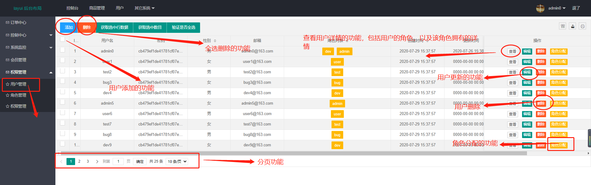
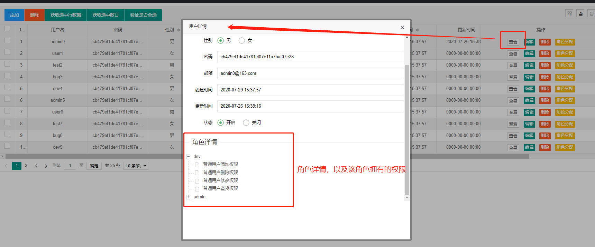
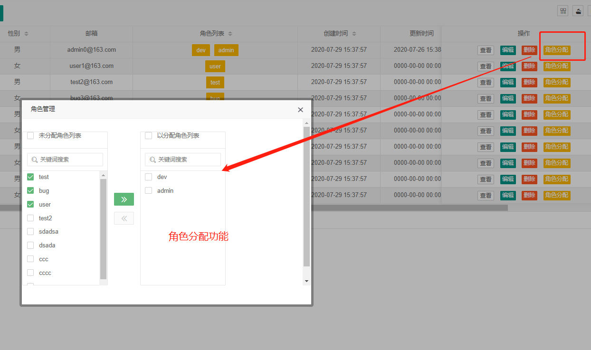
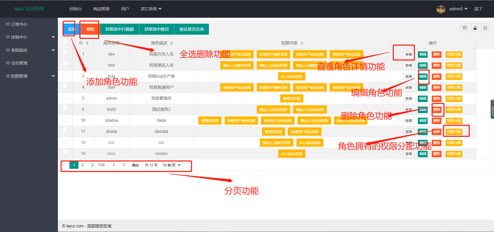
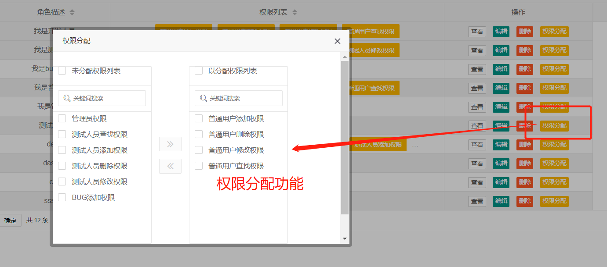
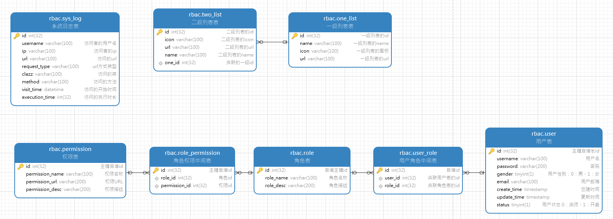
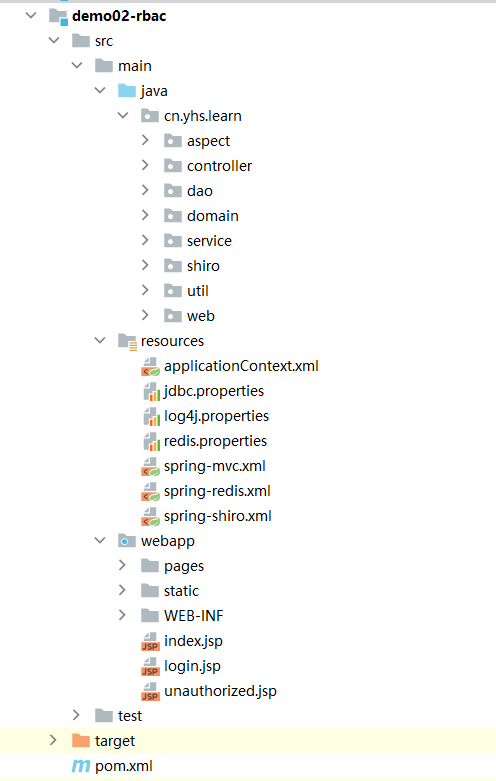

# RBAC

# 一、项目简介

基于角色权限访问控制的企业级管理系统

**用户管理页面详细功能**







**角色管理页面详细功能**



角色的权限分配功能



## 1.1 技术选型

| 技术栈      | 前端技术 | 服务端技术 | 说明             |
| :---------- | :------- | :--------- | :--------------- |
| JDK         |          | ✔          | Java基础开发环境 |
| Spring      |          | ✔          | IoC和AOP容器框架 |
| SpringMVC   |          | ✔          | Web框架          |
| Mybatis     |          | ✔          | 持久层框架       |
| MySQL       |          | ✔          | MySQL数据库      |
| PageHelper  |          | ✔          | 分页插件         |
| Redis       |          | ✔          | Nosql中间件      |
|             |          | ✔          | 安全框架         |
| Maven       |          | ✔          | 项目管理工具     |
| Jackson     |          | ✔          | JSON转换工具     |
| Lombok      |          | ✔          | 提供注解简化编程 |
| Druid       |          | ✔          | 数据库连接池     |
| jQuery      | ✔        |            | JS库             |
| Layui       | ✔        |            | UI 框架          |
| Layer       | ✔        |            | Web弹层组件      |
| Layui.tree  | ✔        |            | Web树形组件      |
| Layui.table | ✔        |            | Web表格组件      |
| Layui.form  | ✔        |            | Web表单组件      |

## **1.2 项目特点**

- 基于全新的Spring、Mybatis、Shiro等主流框架高度整合，提供稳定、高效、安全的基础架构。
- 采用主流的Layui等前端模版框架，上手简单、美观大气、交互体验更完美。
- Maven多模块管理，组件独立且共享，可快速拼装，按需增减。真正解耦合，提高效率。
- 完善的认证鉴权，密码策略、安全审计、日志收集体系，使业务处理更安全、更透明。
- 代码风格优雅简洁、通俗易懂，符合《阿里巴巴JAVA开发手册》规范要求，可作为企业代码规范

## 1.3 内置功能介绍

- 用户管理：用户可以关联一个或多个角色以及用户基本的CRUD、批量删除、导出数据等功能，
- 角色管理：角色可以关联一个或者多个权限以及该角色基本的CRUD、批量删除、导出功能，
- 权限管理：最小颗粒度的权限控制，实现登录用户所拥有的权限控制以及基本的CRUD操作，
- 日志管理：系统业务操作日志，API调用日志，用户登录日志等，
- 监控管理：SQL连接池监控，SQL执行语句分布监控等。

## 1.4  开发规范

### 1.4.1 类约定

实现单个对象包含但不限于以下文件，如下：

| 层次   | 文件名                                 |
| :----- | :------------------------------------- |
| 视图层 | user_info.jsp                          |
| 控制器 | DemoController.java                    |
| 服务层 | DemoService.java、DemoServiceImpl.java |
| 映射层 | DemoMapper.java、DemoMapper.xml        |
| 模型层 | Demo.java、DemoVo.java                 |

### 1.4.2 方法约定

每个对象均具备以下公约方法：

- find 列表查询
- save新增对象
- delete 删除对象
- update 更新对象

### 1.4.3 API响应报文格式约定

采用主流JSON格式，统一返回`BaseResultData`对象格式

```json
{
	"code": 0, 返回错误码 0表示成功
	"count": 0, 返回总条数
	"data": {}, 返回对象/数据列表
	"msg": "成功" 返回详细描述 
}
```

### 1.4.3 数据库字段

```sql
CREATE TABLE `user` (
  `id` int(32) NOT NULL AUTO_INCREMENT COMMENT '主键自增长id',
  `username` varchar(100) NOT NULL COMMENT '用户名',
  `password` varchar(200) NOT NULL COMMENT '密码',
  `gender` tinyint(1) NOT NULL COMMENT '用户性别：0：男，1：女',
  `email` varchar(100) NOT NULL COMMENT '用户邮箱',
  `create_time` timestamp NOT NULL DEFAULT CURRENT_TIMESTAMP ON UPDATE CURRENT_TIMESTAMP COMMENT '创建时间',
  `update_time` timestamp NOT NULL DEFAULT '0000-00-00 00:00:00' COMMENT '更新时间',
  `status` tinyint(1) DEFAULT NULL COMMENT '用户状态 0：关闭，1：开启',
  PRIMARY KEY (`id`)
) ENGINE=InnoDB AUTO_INCREMENT=62 DEFAULT CHARSET=utf8 COMMENT='用户表';
```

- 字段全部小写
- 多个字段采用“_”分割
- 表、字段都要加注释

# 二、项目开发

## 2.1 数据库



详细sql见file/rbac.sql

## 2.2 构建Maven Web工程，导入依赖

```xml
<?xml version="1.0" encoding="UTF-8"?>

<project xmlns="http://maven.apache.org/POM/4.0.0" xmlns:xsi="http://www.w3.org/2001/XMLSchema-instance"
         xsi:schemaLocation="http://maven.apache.org/POM/4.0.0 http://maven.apache.org/xsd/maven-4.0.0.xsd">
    <parent>
        <artifactId>ssm-project-demo</artifactId>
        <groupId>cn.yhs.learn</groupId>
        <version>1.0-SNAPSHOT</version>
    </parent>
    <modelVersion>4.0.0</modelVersion>
    <artifactId>demo02-rbac</artifactId>
    <packaging>war</packaging>
    <name>demo02-rbac</name>
    <!--========================== 版本控制 ========================-->
    <properties>
        <project.build.sourceEncoding>UTF-8</project.build.sourceEncoding>
        <maven.compiler.source>1.8</maven.compiler.source>
        <maven.compiler.target>1.8</maven.compiler.target>
        <!--spring版本-->
        <spring.version>5.0.4.RELEASE</spring.version>
        <!--spring-shiro整合的版本-->
        <spring.shiro.version>1.4.0</spring.shiro.version>
        <!--spring-redis整合的版本-->
        <spring.redis.version>1.7.5.RELEASE</spring.redis.version>
        <!--druid版本-->
        <druid.version>1.1.10</druid.version>
        <!--MySQL版本-->
        <mysql.version>5.1.47</mysql.version>
        <!--MyBatis版本-->
        <mybatis.version>3.4.6</mybatis.version>
        <!--MyBatis整合Spring的版本-->
        <mybatis.spring.version>1.3.2</mybatis.spring.version>
        <!--分页插件版本-->
        <pagehelper.version>5.1.8</pagehelper.version>
        <!--redis客户端版本-->
        <jedis.version>2.8.1</jedis.version>
        <!--junit版本-->
        <junit.version>4.12</junit.version>
        <!--Lombok版本-->
        <lombok.version>1.18.8</lombok.version>
        <!--jackson版本-->
        <jackson.version>2.10.0</jackson.version>
        <!--slf4j版本-->
        <slf4j.version>1.7.21</slf4j.version>
        <!--log4j版本-->
        <log4j.version>1.2.17</log4j.version>
        <!--JSR303版本-->
        <hibernate.validator.version>5.4.1.Final</hibernate.validator.version>
    </properties>
    <!--============================== 依赖控制 ==============================-->
    <dependencies>
        <!--===================================== Web Start ================================-->
        <!--jstl-->
        <dependency>
            <groupId>javax.servlet</groupId>
            <artifactId>jstl</artifactId>
            <version>1.2</version>
        </dependency>
        <!--servlet-->
        <dependency>
            <groupId>javax.servlet</groupId>
            <artifactId>javax.servlet-api</artifactId>
            <version>3.1.0</version>
            <scope>provided</scope>
        </dependency>
        <!--webmvc-->
        <dependency>
            <groupId>org.springframework</groupId>
            <artifactId>spring-webmvc</artifactId>
            <version>${spring.version}</version>
        </dependency>
        <!--===================================== Web End ===================================-->
        <!--===================================== Service Start =============================-->
        <!--切面编程-->
        <dependency>
            <groupId>org.springframework</groupId>
            <artifactId>spring-aspects</artifactId>
            <version>${spring.version}</version>
        </dependency>
        <!--事务管理-->
        <dependency>
            <groupId>org.springframework</groupId>
            <artifactId>spring-jdbc</artifactId>
            <version>${spring.version}</version>
        </dependency>
        <!--===================================== Service End ===============================-->
        <!--===================================== Dao Start =================================-->
        <!--Druid数据源-->
        <dependency>
            <groupId>com.alibaba</groupId>
            <artifactId>druid</artifactId>
            <version>${druid.version}</version>
        </dependency>
        <!--MySQL-->
        <dependency>
            <groupId>mysql</groupId>
            <artifactId>mysql-connector-java</artifactId>
            <version>${mysql.version}</version>
        </dependency>
        <!--MyBatis-->
        <dependency>
            <groupId>org.mybatis</groupId>
            <artifactId>mybatis</artifactId>
            <version>${mybatis.version}</version>
        </dependency>
        <!--分页插件-->
        <dependency>
            <groupId>com.github.pagehelper</groupId>
            <artifactId>pagehelper</artifactId>
            <version>${pagehelper.version}</version>
        </dependency>
        <!-- redis客户端缓存 -->
        <dependency>
            <groupId>redis.clients</groupId>
            <artifactId>jedis</artifactId>
            <version>${jedis.version}</version>
        </dependency>
        <!--===================================== Dao End ===================================-->
        <!--===================================== Utils Start ===============================-->
        <!--junit单元测试-->
        <dependency>
            <groupId>junit</groupId>
            <artifactId>junit</artifactId>
            <version>${junit.version}</version>
            <!--  <scope>test</scope>-->
        </dependency>
        <!--lombok-->
        <dependency>
            <groupId>org.projectlombok</groupId>
            <artifactId>lombok</artifactId>
            <version>${lombok.version}</version>
            <scope>provided</scope>
        </dependency>
        <!--jackson-->
        <dependency>
            <groupId>com.fasterxml.jackson.core</groupId>
            <artifactId>jackson-databind</artifactId>
            <version>${jackson.version}</version>
        </dependency>
        <!--log4j的jar包-->
        <!--一定要把log4j日志的放在前面，让它先加载，这样就能显示日志信息了-->
        <dependency>
            <groupId>log4j</groupId>
            <artifactId>log4j</artifactId>
            <version>${log4j.version}</version>
        </dependency>
        <!--日志门面-->
        <!-- https://mvnrepository.com/artifact/org.slf4j/slf4j-api -->
        <dependency>
            <groupId>org.slf4j</groupId>
            <artifactId>slf4j-api</artifactId>
            <version>${slf4j.version}</version>
        </dependency>
        <!--绑定log4j需要绑定适配器-->
        <dependency>
            <groupId>org.slf4j</groupId>
            <artifactId>slf4j-log4j12</artifactId>
            <version>${slf4j.version}</version>
        </dependency>

        <!--JSR303数据校验-->
        <dependency>
            <groupId>org.hibernate</groupId>
            <artifactId>hibernate-validator</artifactId>
            <version>${hibernate.validator.version}</version>
        </dependency>
        <!--===================================== Utils End =================================-->
        <!--===================================== 整合 Start =================================-->
        <!--spring和Junit的整合, SpringJUnit4ClassRunner requires JUnit 4.12 or higher.-->
        <dependency>
            <groupId>org.springframework</groupId>
            <artifactId>spring-test</artifactId>
            <version>${spring.version}</version>
            <!--<scope>test</scope> -->
            <scope>compile</scope>
        </dependency>
        <!--spring和MyBatis的整合-->
        <dependency>
            <groupId>org.mybatis</groupId>
            <artifactId>mybatis-spring</artifactId>
            <version>${mybatis.spring.version}</version>
        </dependency>
        <!--spring和shiro的整合-->
        <dependency>
            <groupId>org.apache.shiro</groupId>
            <artifactId>shiro-spring</artifactId>
            <version>${spring.shiro.version}</version>
        </dependency>
        <!--spring和redis整合-->
        <dependency>
            <groupId>org.springframework.data</groupId>
            <artifactId>spring-data-redis</artifactId>
            <version>${spring.redis.version}</version>
        </dependency>
        <!--===================================== 整合 End =================================-->
    </dependencies>
</project>
```

## 2.3 项目结构



## 2.4 配置文件

### 2.4.1 applicationContext.xml

配置mysql数据源。druid的监控，分页插件，service层的事务控制

```xml
<?xml version="1.0" encoding="UTF-8"?>
<beans xmlns="http://www.springframework.org/schema/beans"
       xmlns:xsi="http://www.w3.org/2001/XMLSchema-instance"
       xmlns:context="http://www.springframework.org/schema/context" xmlns:tx="http://www.springframework.org/schema/tx"
       xmlns:aop="http://www.springframework.org/schema/aop"
       xsi:schemaLocation="http://www.springframework.org/schema/beans http://www.springframework.org/schema/beans/spring-beans.xsd http://www.springframework.org/schema/context http://www.springframework.org/schema/context/spring-context.xsd http://www.springframework.org/schema/tx http://www.springframework.org/schema/tx/spring-tx.xsd http://www.springframework.org/schema/aop http://www.springframework.org/schema/aop/spring-aop.xsd">
    <!--1.基包扫描，排除扫描带有@Controller注解的类-->
    <context:component-scan base-package="cn.yhs.learn">
        <context:exclude-filter type="annotation" expression="org.springframework.stereotype.Controller"/>
    </context:component-scan>
    <!--============================== Dao Start ================================-->
    <!--2.配置Druid数据源-->
    <context:property-placeholder location="classpath*:*.properties"/>
    <bean class="com.alibaba.druid.pool.DruidDataSource" id="dataSource" init-method="init" destroy-method="close">
        <property name="driverClassName" value="${druid.jdbc.driverClassName}"/>
        <property name="url" value="${druid.jdbc.url}"/>
        <property name="username" value="${druid.jdbc.username}"/>
        <property name="password" value="${druid.jdbc.password}"/>
        <property name="initialSize" value="${druid.jdbc.initialSize}"/>
        <property name="maxActive" value="${druid.jdbc.maxActive}"/>
        <property name="maxWait" value="${druid.jdbc.maxWait}"/>
        <!--2.1配置Druid的监控过滤器-->
        <!--别名配置是通过filters属性配置的，filters属性的类型是String。如果需要通过bean的方式配置，使用proxyFilters属性。-->
        <property name="proxyFilters">
            <list>
                <ref bean="statFilter"/>
            </list>
        </property>
    </bean>
    <!--2.2配置Druid的监控功能-->
    <bean class="com.alibaba.druid.filter.stat.StatFilter" id="statFilter">
        <!--SQL合并配置-->
        <property name="mergeSql" value="true"/>
        <!--属性slowSqlMillis用来配置SQL慢的标准，执行时间超过slowSqlMillis的就是慢。slowSqlMillis的缺省值为3000，也就是3秒。-->
        <property name="slowSqlMillis" value="10000"/>
        <!--在上面的配置中，slowSqlMillis被修改为10秒，并且通过日志输出执行慢的SQL。-->
        <property name="logSlowSql" value="true"/>
    </bean>
    <!--3.配置SqlSessionFactory-->
    <bean class="org.mybatis.spring.SqlSessionFactoryBean" id="sqlSessionFactory">
        <property name="dataSource" ref="dataSource"/>
        <!--3.1使用插件的方式配置分页工具-->
        <property name="plugins">
            <array>
                <bean class="com.github.pagehelper.PageInterceptor" id="pageInterceptor">
                    <property name="properties">
                        <!--使用下面的方式配置参数，一行配置一个 -->
                        <value>
                            helperDialect=mysql
                            reasonable=true
                        </value>
                    </property>
                </bean>
            </array>
        </property>
    </bean>
    <!--4.配置批量操作的sqlSessionTemplate-->
    <bean id="sqlSessionTemplate" class="org.mybatis.spring.SqlSessionTemplate">
        <constructor-arg name="sqlSessionFactory" ref="sqlSessionFactory"/>
        <constructor-arg name="executorType" value="BATCH"/>
    </bean>
    <!--5.配置dao扫描-->
    <bean class="org.mybatis.spring.mapper.MapperScannerConfigurer" id="mapperScannerConfigurer">
        <property name="basePackage" value="cn.yhs.learn.dao"/>
    </bean>
    <!--============================== Dao End ================================-->
    <!--============================== Service Start ================================-->
    <!--6.配置数据源事务管理器-->
    <bean class="org.springframework.jdbc.datasource.DataSourceTransactionManager" id="transactionManager">
        <property name="dataSource" ref="dataSource"/>
    </bean>
    <!--7. 配置声明式事务,可以使用xml配置，可以使用注解-->
    <tx:advice transaction-manager="transactionManager" id="txAdvice">
        <tx:attributes>
            <tx:method name="find*" read-only="true"/>
            <tx:method name="*"/>
        </tx:attributes>
    </tx:advice>
    <!--8. 使用切面的方式进行事务控制，service层的进行切面控制-->
    <aop:config>
        <aop:pointcut id="pt1" expression="execution(* cn.yhs.learn.service.*.*(..))"/>
        <aop:advisor advice-ref="txAdvice" pointcut-ref="pt1"/>
    </aop:config>
    <!--============================== Service End ================================-->
</beans>
```

### 2.4.2 spring-mvc.xml

配置前端视图解析器

```xml
<?xml version="1.0" encoding="UTF-8"?>
<beans xmlns="http://www.springframework.org/schema/beans"
       xmlns:xsi="http://www.w3.org/2001/XMLSchema-instance"
       xmlns:context="http://www.springframework.org/schema/context"
       xmlns:mvc="http://www.springframework.org/schema/mvc"
       xsi:schemaLocation="http://www.springframework.org/schema/beans http://www.springframework.org/schema/beans/spring-beans.xsd http://www.springframework.org/schema/context http://www.springframework.org/schema/context/spring-context.xsd http://www.springframework.org/schema/mvc http://www.springframework.org/schema/mvc/spring-mvc.xsd">
    <!--spring webmvc的配置文件-->
    <!--1.配置基本包的扫描,只扫描带有@Controller的注解-->
    <context:component-scan base-package="cn.yhs.learn">
        <context:include-filter type="annotation" expression="org.springframework.stereotype.Controller"/>
    </context:component-scan>
    <!--2.配置视图解析器-->
    <bean class="org.springframework.web.servlet.view.InternalResourceViewResolver" id="viewResolver">
        <property name="prefix" value="/pages/"/>
        <property name="suffix" value=".jsp"/>
    </bean>
    <!--3.spring web处理不了资源，交给Tomcat处理(过滤静态资源)-->
    <mvc:default-servlet-handler/>
    <!--4.开启注解支持-->
    <mvc:annotation-driven/>
</beans>
```

### 2.4.3 spring-redis.xml

spring和redis整合的配置文件

```xml
<?xml version="1.0" encoding="UTF-8"?>
<beans xmlns="http://www.springframework.org/schema/beans"
       xmlns:xsi="http://www.w3.org/2001/XMLSchema-instance"
       xmlns:context="http://www.springframework.org/schema/context"
       xsi:schemaLocation="http://www.springframework.org/schema/beans http://www.springframework.org/schema/beans/spring-beans.xsd http://www.springframework.org/schema/context http://www.springframework.org/schema/context/spring-context.xsd">
    <context:property-placeholder location="classpath*:*.properties"/>
    <!--1. 配置redis连接池配置-->
    <bean class="redis.clients.jedis.JedisPoolConfig" id="jedisPoolConfig">
        <!--最大空闲数-->
        <property name="maxIdle" value="${redis.maxIdle}"/>
        <!--连接池的最大数据库连接数  -->
        <property name="maxTotal" value="${redis.maxTotal}"/>
        <!--最大建立连接等待时间-->
        <property name="maxWaitMillis" value="${redis.maxWaitMillis}"/>
        <!--逐出连接的最小空闲时间 默认1800000毫秒(30分钟)-->
        <property name="minEvictableIdleTimeMillis" value="${redis.minEvictableIdleTimeMillis}"/>
        <!--每次逐出检查时 逐出的最大数目 如果为负数就是 : 1/abs(n), 默认3-->
        <property name="numTestsPerEvictionRun" value="${redis.numTestsPerEvictionRun}"/>
        <!--逐出扫描的时间间隔(毫秒) 如果为负数,则不运行逐出线程, 默认-1-->
        <property name="timeBetweenEvictionRunsMillis" value="${redis.timeBetweenEvictionRunsMillis}"/>
        <!--是否在从池中取出连接前进行检验,如果检验失败,则从池中去除连接并尝试取出另一个-->
        <property name="testOnBorrow" value="${redis.testOnBorrow}"/>
        <!--在空闲时检查有效性, 默认false  -->
        <property name="testWhileIdle" value="${redis.testWhileIdle}"/>
    </bean>
    <!--2. 配置redis连接工厂-->
    <bean class="org.springframework.data.redis.connection.jedis.JedisConnectionFactory" id="jedisConnectionFactory">
        <property name="poolConfig" ref="jedisPoolConfig"/>
        <property name="hostName" value="${redis.hostName}"/>
        <property name="port" value="${redis.port}"/>
    </bean>
    <!--
    可以选择 Spring 提供的方案去处理序列化，当然也可以去实现在 spring data redis 中定义的 RedisSerializer 接口，在 Spring 中提供了以下几种实现 RedisSerializer 接口的序列化器。
        GenericJackson2JsonRedisSerializer，通用的使用 Json2.jar 的包，将 Redis 对象的序列化器。
        Jackson2JsonRedisSerializer<T>，通过 Jackson2.jar 包提供的序列化进行转换（由于版本太旧，Spring 不推荐使用）。
        JdkSerializationRedisSerializer<T>，使用 JDK 的序列化器进行转化。
        OxmSerializer，使用 Spring O/X 对象 Object 和 XML 相互转换。
        StringRedisSerializer，使用字符串进行序列化。
        GenericToStringSerializer，通过通用的字符串序列化进行相互转换。
    -->
    <!--3.配置k-v的序列化方式-->
    <bean class="org.springframework.data.redis.serializer.StringRedisSerializer" id="stringRedisSerializer"/>
    <bean class="org.springframework.data.redis.serializer.JdkSerializationRedisSerializer"
          id="jdkSerializationRedisSerializer"/>
    <!--4. 配置RedisTemplate，方便我们操作redis-->
    <bean class="org.springframework.data.redis.core.RedisTemplate" id="redisTemplate">
        <property name="connectionFactory" ref="jedisConnectionFactory"/>
        <!--指定序列化器，默认是 JdkSerializationRedisSerializer-->
        <property name="defaultSerializer" ref="stringRedisSerializer"/>
        <property name="keySerializer" ref="stringRedisSerializer"/>
        <property name="valueSerializer" ref="jdkSerializationRedisSerializer"/>
        <property name="hashKeySerializer" ref="stringRedisSerializer"/>
        <property name="hashValueSerializer" ref="jdkSerializationRedisSerializer"/>
        <!-- 默认事务是关闭的， private boolean enableTransactionSupport = false;-->
        <property name="enableTransactionSupport" value="true"/>
    </bean>
</beans>
```

### 2.4.4 spring-shiro.xml

spring和shiro的整合的配置文件

```xml
<?xml version="1.0" encoding="UTF-8"?>
<beans xmlns="http://www.springframework.org/schema/beans"
       xmlns:xsi="http://www.w3.org/2001/XMLSchema-instance"
       xsi:schemaLocation="http://www.springframework.org/schema/beans http://www.springframework.org/schema/beans/spring-beans.xsd">
    <!--配置shiro-->
    <!--1.声明密码匹配器-->
    <bean class="org.apache.shiro.authc.credential.HashedCredentialsMatcher" id="credentialsMatcher">
        <!--1.1指定算法名称-->
        <property name="hashAlgorithmName" value="md5"/>
        <!--1.2指定散列次数-->
        <property name="hashIterations" value="2"/>
    </bean>
    <!--2.配置自定义的Realm-->
    <bean class="cn.yhs.learn.shiro.MyLoginRealm" id="myLoginRealm">
        <property name="credentialsMatcher" ref="credentialsMatcher"/>
    </bean>
    <!--3.配置WebSecurityManager-->
    <bean class="org.apache.shiro.web.mgt.DefaultWebSecurityManager" id="defaultWebSecurityManager">
        <property name="realm" ref="myLoginRealm"/>
    </bean>
    <!--4.配置shiro的web过滤器-->
    <bean class="org.apache.shiro.spring.web.ShiroFilterFactoryBean" id="shiroFilter">
        <!--注入安全管理器-->
        <property name="securityManager" ref="defaultWebSecurityManager"/>
        <!--要登录的url-->
        <property name="loginUrl" value="/login.jsp"/>
        <!--配置未授权的url-->
        <property name="unauthorizedUrl" value="/unauthorized.jsp"/>
        <!--配置过滤器链-->
        <property name="filterChainDefinitions">
            <value>
                /static/** = anon
                /login.jsp = anon
                <!-- 执行登录请求的操作-->
                /users/userLogin = anon
                <!--用户退出执行的过滤器-->
                /users/userLogout = logout
                /unauthorized.jsp = anon
                <!--设置其他路劲全部拦截，只有认证通过之后才会资源查看-->
                /** = authc
            </value>
        </property>
    </bean>
</beans>
```

### 2.4.5 jdbc.properties

```properties
# druid 的配置文件
druid.jdbc.driverClassName=com.mysql.jdbc.Driver
# ?zeroDateTimeBehavior=convertToNull 参数解决0000-00-00 00:00:00的日期转换问题
druid.jdbc.url=jdbc:mysql:///rbac?zeroDateTimeBehavior=convertToNull
druid.jdbc.username=root
druid.jdbc.password=123456
druid.jdbc.maxWait=2000
druid.jdbc.initialSize=10
druid.jdbc.maxActive=10
```

### 2.4.6 redis.properties

```properties
#ip地址
redis.hostName=192.168.1.101
#端口号
redis.port=6379
#如果有密码
#redis.password=
#客户端超时时间单位是毫秒 默认是2000
redis.timeout=2000
#最大空闲数
redis.maxIdle=10
#连接池的最大数据库连接数。设为0表示无限制,如果是jedis 2.4以后用redis.maxTotal
redis.maxActive=10
#控制一个pool可分配多少个jedis实例,用来替换上面的redis.maxActive,如果是jedis 2.4以后用该属性
redis.maxTotal=10
#最大建立连接等待时间。如果超过此时间将接到异常。设为-1表示无限制。
redis.maxWaitMillis=1000
#连接的最小空闲时间 默认1800000毫秒(30分钟)
redis.minEvictableIdleTimeMillis=300000
#每次释放连接的最大数目,默认3
redis.numTestsPerEvictionRun=1024
#逐出扫描的时间间隔(毫秒) 如果为负数,则不运行逐出线程, 默认-1
redis.timeBetweenEvictionRunsMillis=30000
#是否在从池中取出连接前进行检验,如果检验失败,则从池中去除连接并尝试取出另一个
redis.testOnBorrow=false
#在空闲时检查有效性, 默认false
redis.testWhileIdle=false
```

### 2.4.7 web.xml

```xml
<!DOCTYPE web-app PUBLIC
        "-//Sun Microsystems, Inc.//DTD Web Application 2.3//EN"
        "http://java.sun.com/dtd/web-app_2_3.dtd" >
<web-app>
    <display-name>Archetype Created Web Application</display-name>
    <!-- 1.容器初始化参数，ContextLoadListener监听器创建的时候就会加载参数-->
    <context-param>
        <param-name>contextConfigLocation</param-name>
        <!--加载spring容器的配置文件，以及和sprig整合的框架的配置文件-->
        <param-value>classpath:applicationContext.xml,classpath*:spring-shiro.xml,classpath*:spring-redis.xml
        </param-value>
    </context-param>
    <!--=============================================== filter start ================================================-->
    <!-- 2. 配置POST方式编码，解决前端POST提交参数的乱码问题-->
    <filter>
        <filter-name>characterEncodingFilter</filter-name>
        <filter-class>org.springframework.web.filter.CharacterEncodingFilter</filter-class>
        <init-param>
            <param-name>encoding</param-name>
            <param-value>UTF-8</param-value>
        </init-param>
        <init-param>
            <param-name>forceEncoding</param-name>
            <param-value>true</param-value>
        </init-param>
    </filter>
    <!-- 3. 改变发送PUT和DELETE请求.-->
    <!--form表单直接使用method="POST"的方式提交，提交一个隐藏的input  <input type="hidden" name="_method" value="put" />-->
    <filter>
        <filter-name>httpMethodFilter</filter-name>
        <filter-class>org.springframework.web.filter.HiddenHttpMethodFilter</filter-class>
    </filter>
    <!--4. 配置shiroFilter-->
    <filter>
        <filter-name>shiroFilter</filter-name>
        <filter-class>org.springframework.web.filter.DelegatingFilterProxy</filter-class>
    </filter>
    <!--2.1 拦截所有请求，在所有过滤器的前面-->
    <filter-mapping>
        <filter-name>characterEncodingFilter</filter-name>
        <url-pattern>/*</url-pattern>
    </filter-mapping>
    <!--3.1 拦截改变请求方式-->
    <filter-mapping>
        <filter-name>httpMethodFilter</filter-name>
        <url-pattern>/*</url-pattern>
    </filter-mapping>
    <!--4.1 shiroFilter映射-->
    <filter-mapping>
        <filter-name>shiroFilter</filter-name>
        <url-pattern>/*</url-pattern>
    </filter-mapping>
    <!--=============================================== filter end ================================================-->
    <!--=============================================== listener start ============================================-->
    <!--5. 配置Web监听器，通过第1步配置的容器参数创建spring ioc 容器-->
    <listener>
        <listener-class>org.springframework.web.context.ContextLoaderListener</listener-class>
    </listener>
    <!--6.自定义的监听器，用于设置全局应用名称，web中所有页面的路劲需要用到-->
    <listener>
        <listener-class>cn.yhs.learn.web.AppPathListener</listener-class>
    </listener>
    <!--7.配置监听器，加载RequestContextListener,创建HttpServletRequest,AOP切面日志需要用到-->
    <listener>
        <listener-class>org.springframework.web.context.request.RequestContextListener</listener-class>
    </listener>
    <!--=============================================== listener end ==============================================-->
    <!--=============================================== servlet start =============================================-->
    <!--8.配置前端控制转发器，并创建Spring webmvc容器-->
    <servlet>
        <servlet-name>dispatcherServlet</servlet-name>
        <servlet-class>org.springframework.web.servlet.DispatcherServlet</servlet-class>
        <init-param>
            <param-name>contextConfigLocation</param-name>
            <param-value>classpath:spring-mvc.xml</param-value>
        </init-param>
        <!--5.1改变启动顺序，tomcat启动的时候就创建-->
        <load-on-startup>1</load-on-startup>
    </servlet>
    <!--9.配置druid的监控页面-->
    <!--配置Druid的内置监控页面，Druid内置提供了一个StatViewServlet用于展示Druid的统计信息。
        这个StatViewServlet的用途包括：提供监控信息展示的html页面，提供监控信息的JSON API-->
    <!-- 配置 Druid 监控信息显示页面 -->
    <servlet>
        <servlet-name>DruidStatView</servlet-name>
        <servlet-class>com.alibaba.druid.support.http.StatViewServlet</servlet-class>
        <init-param>
            <!-- 允许清空统计数据 -->
            <param-name>resetEnable</param-name>
            <param-value>true</param-value>
        </init-param>
        <init-param>
            <!-- 用户名 -->
            <param-name>loginUsername</param-name>
            <param-value>admin</param-value>
        </init-param>
        <init-param>
            <!-- 密码 -->
            <param-name>loginPassword</param-name>
            <param-value>admin</param-value>
        </init-param>
    </servlet>
    <servlet-mapping>
        <servlet-name>DruidStatView</servlet-name>
        <url-pattern>/druid/*</url-pattern>
    </servlet-mapping>
    <servlet-mapping>
        <servlet-name>dispatcherServlet</servlet-name>
        <url-pattern>/</url-pattern>
    </servlet-mapping>
    <!--=============================================== servlet end ===============================================-->
    <!-- 6. 配置首页-->
    <welcome-file-list>
        <welcome-file>index.jsp</welcome-file>
        <welcome-file>index.html</welcome-file>
    </welcome-file-list>
</web-app>

```

### 2.4.8 log4j.properties

```properties
# Set root category priority to INFO and its only appender to CONSOLE.
#log4j.rootCategory=INFO, CONSOLE            debug   info   warn error fatal
#log4j.rootCategory=debug, CONSOLE, LOGFILE
#log4j.rootCategory=debug, CONSOLE
log4j.rootCategory=info, CONSOLE
# Set the enterprise logger category to FATAL and its only appender to CONSOLE.
# log4j.logger.org.apache.axis.enterprise=FATAL, CONSOLE
# CONSOLE is set to be a ConsoleAppender using a PatternLayout.
log4j.appender.CONSOLE=org.apache.log4j.ConsoleAppender
log4j.appender.CONSOLE.layout=org.apache.log4j.PatternLayout
log4j.appender.CONSOLE.layout.ConversionPattern=%d{ISO8601} %-6r [%15.15t] %-5p %30.30c %x - %m\n
# LOGFILE is set to be a File appender using a PatternLayout.
# log4j.appender.LOGFILE=org.apache.log4j.FileAppender
# log4j.appender.LOGFILE.File=d:\axis.log
# log4j.appender.LOGFILE.Append=true
# log4j.appender.LOGFILE.layout=org.apache.log4j.PatternLayout
# log4j.appender.LOGFILE.layout.ConversionPattern=%d{ISO8601} %-6r [%15.15t] %-5p %30.30c %x - %m\n
```

## 2.5 具体开发

详情见具体的代码

## 2.6 切面日志

### 2.6.1 domain

```java
package cn.yhs.learn.domain;

import cn.yhs.learn.util.DateUtils;
import lombok.AllArgsConstructor;
import lombok.Data;
import lombok.NoArgsConstructor;

import java.util.Date;

/**
 * @ProjectName: ssm-project-demo
 * @Name: cn.yhs.learn.domain.SysLog
 * @Author: Splendor -- 加油,你是最棒的 ~_~
 * @Email: 15617577080@163.com
 * @Time: 2020/7/23 13:50
 * @Description: 操作日志
 **/
@AllArgsConstructor
@NoArgsConstructor
@Data
public class SysLog {
    private Integer id;
    private String username; // 执行的用户
    private String ip; // ip
    private String url; // 执行的url
    private String requestType; // 请求类型
    //  private String requestParam; // 请求参数
    private String clazz; // 执行的当前类
    private String method; // 执行的方法
    private Date visitTime; // 访问的开始时间
    private String visitTimeStr;
    private int executionTime; // 执行时长

    public String getVisitTimeStr() {
        return this.getVisitTime() != null ? DateUtils.date2String(this.getVisitTime()) : "0000-00-00 00:00:00";
    }
}

```

### 2.6.2 dao

```java
package cn.yhs.learn.dao;

import cn.yhs.learn.domain.SysLog;
import org.apache.ibatis.annotations.Insert;
import org.apache.ibatis.annotations.Result;
import org.apache.ibatis.annotations.Results;
import org.apache.ibatis.annotations.Select;
import org.springframework.stereotype.Repository;

import java.util.List;

/**
 * @ProjectName: ssm-project-demo
 * @Name: cn.yhs.learn.dao.SysLogDao
 * @Author: Splendor -- 加油,你是最棒的 ~_~
 * @Email: 15617577080@163.com
 * @Time: 2020/7/23 14:07
 * @Description: todo
 **/
@Repository
public interface SysLogDao {
    /**
     * 查询所有日志
     *
     * @return
     */
    @Select("select * from sys_log")
    @Results(id = "syslog", value = {
            @Result(id = true, column = "id", property = "id"),
            @Result(column = "request_type", property = "requestType"),
            // @Result(column = "request_param", property = "requestParam"),
            @Result(column = "visit_time", property = "visitTime"),
            @Result(column = "execution_time", property = "executionTime")
    })
    List<SysLog> findAll();

    /**
     * 保存日志
     *
     * @param sysLog
     */
    @Insert("insert into sys_log(username,ip,url,clazz,method,visit_time,execution_time,request_type) value(#{username},#{ip},#{url},#{clazz},#{method},#{visitTime},#{executionTime},#{requestType})")
    void saveSysLog(SysLog sysLog);
}

```

### 2.6.3 service

```java
package cn.yhs.learn.service.impl;

import cn.yhs.learn.dao.SysLogDao;
import cn.yhs.learn.domain.SysLog;
import cn.yhs.learn.service.SyslogService;
import org.springframework.beans.factory.annotation.Autowired;
import org.springframework.stereotype.Controller;
import org.springframework.stereotype.Service;

import java.util.List;

/**
 * @ProjectName: ssm-project-demo
 * @Name: cn.yhs.learn.service.impl.SyslogServiveImpl
 * @Author: Splendor -- 加油,你是最棒的 ~_~
 * @Email: 15617577080@163.com
 * @Time: 2020/7/23 15:16
 * @Description: todo
 **/
@Service
public class SyslogServiceImpl implements SyslogService {

    @Autowired
    private SysLogDao sysLogDao;

    @Override
    public List<SysLog> findAll() {
        return sysLogDao.findAll();
    }

    @Override
    public void saveSysLog(SysLog sysLog) {
        sysLogDao.saveSysLog(sysLog);
    }
}

```

### 2.6.4 controller切面类

使用切面进行切入到controller层的所有方法进行控制

```java
package cn.yhs.learn.aspect;

import cn.yhs.learn.domain.SysLog;
import cn.yhs.learn.service.SyslogService;
import lombok.extern.slf4j.Slf4j;
import org.aspectj.lang.JoinPoint;
import org.aspectj.lang.annotation.After;
import org.aspectj.lang.annotation.Aspect;
import org.aspectj.lang.annotation.Before;
import org.aspectj.lang.annotation.Pointcut;
import org.springframework.beans.factory.annotation.Autowired;
import org.springframework.context.annotation.EnableAspectJAutoProxy;
import org.springframework.stereotype.Component;
import org.springframework.web.bind.annotation.RequestMapping;
import org.springframework.web.bind.annotation.RequestMethod;

import javax.servlet.http.HttpServletRequest;
import java.lang.reflect.Method;
import java.util.Date;


/**
 * @ProjectName: ssm-project-demo
 * @Name: cn.yhs.learn.aspect.ControllerLog
 * @Author: Splendor -- 加油,你是最棒的 ~_~
 * @Email: 15617577080@163.com
 * @Time: 2020/7/23 13:41
 * @Description: Controller层操作日志切面
 **/
// 声明成一个切面
@Aspect  // 开启切面支持
@EnableAspectJAutoProxy // 让Spring管理
@Component
@Slf4j
public class ControllerLogAspect {
    // 自动注入request对象，是为了获取用户的地址及相关信息
    @Autowired
    private HttpServletRequest request;
    @Autowired
    private SyslogService syslogService;
    private SysLog sysLog = new SysLog();
    private String username; // 执行的用户
    private String ip; // ip
    private String url; // 执行的url
    private String requestType; // 请求类型
    // private String requestParam; // 请求参数,获取有问题，后面待改进
    private String clazz; // 执行的当前类
    private String method; // 执行的方法
    private Date visitTime; // 访问的开始时间
    private int executionTime; // 执行时长

    /**
     * 配置切入点，只切面到Controller层
     */
    @Pointcut(value = "execution(* cn.yhs.learn.controller.*.*(..))")
    public void pointCut() {
    }

    @Before(value = "pointCut()")
    public void logStart(JoinPoint jp) throws NoSuchMethodException {
        log.debug("start =============>controller层切面开始：记录访问日志");
        // 获取各个日志对象的参数，进行封装
        // todo 获取用户名,通多request对象获取当前登录的用户名
        username = "yuhansheng";
        sysLog.setUsername(username);
        // 获取ip,通过request对象进行获取
        ip = request.getRemoteHost();
        sysLog.setIp(ip);
        // 获取当前切入对象的类 clazz
        Class<?> objectClass = jp.getTarget().getClass();
        // 获取类的全名称
        clazz = objectClass.getName();
        sysLog.setClazz(clazz);
        // 获取当前切入点的 method
        method = jp.getSignature().getName();
        sysLog.setMethod(method);
        // 获取开始时间
        visitTime = new Date();
        sysLog.setVisitTime(visitTime);
        // 获取url：类上注解+方法上的注解@RequestMapping(value="",)
        // 获取类上的注解
        RequestMapping classRequestMapping = objectClass.getDeclaredAnnotation(RequestMapping.class);
        String classUrl = getValueOrPath(classRequestMapping);
        // 获取方法上的注解
        Object[] args = jp.getArgs();
        // 获取当前执行方法的所有参数
        // requestParam = Arrays.toString(args);
        // sysLog.setRequestParam(requestParam);
        Class[] argsClass = new Class[args.length];
        for (int i = 0; i < args.length; i++) {
            argsClass[i] = args[i].getClass();
        }
        Method method = objectClass.getMethod(this.method, argsClass);
        // 获取当前执行方法上的注解
        RequestMapping methodRequestMapping = method.getDeclaredAnnotation(RequestMapping.class);
        String methodUrl = getValueOrPath(methodRequestMapping);
        url = classUrl + methodUrl;
        sysLog.setUrl(url);
        if (methodRequestMapping.method().length > 0) {
            RequestMethod requestMethod = methodRequestMapping.method()[0];
            // 默认的请求方式是GET
            requestType = requestMethod.name();
        } else {
            requestType = "GET";
        }
        sysLog.setRequestType(requestType);
    }

    @After(value = "pointCut()")
    public void logEnd() {
        // 获取执行时长
        executionTime = (int) (System.currentTimeMillis() - visitTime.getTime());
        sysLog.setExecutionTime(executionTime);
        // 保存日志,不要保存日志控制层的数据
        if (!"cn.yhs.learn.controller.SyslogController".equals(clazz))
            syslogService.saveSysLog(this.sysLog);
        log.debug("end ===========>controller层切面结束");
    }

    /**
     * 获取RequestMapping注解上的路劲值
     *
     * @param requestMapping
     * @return
     */
    public String getValueOrPath(RequestMapping requestMapping) {
        if (requestMapping.value().length > 0)
            return requestMapping.value()[0];
        if (requestMapping.path().length > 0)
            return requestMapping.path()[0];
        return "";
    }

}
```

