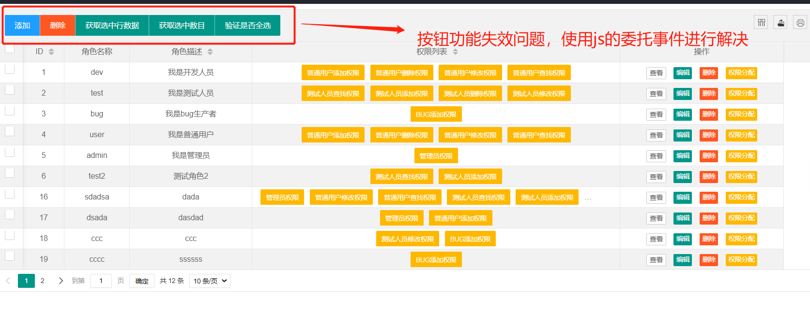

# RBAC项目中遇到的bug

## 1. JSP中使用<jsp:include page="pages/head.jsp"/>遇到的乱码问题

解决方案：引入`<%@ page contentType="text/html;charset=UTF-8" language="java" isELIgnored="false" %>`

```jsp
<%@ page contentType="text/html;charset=UTF-8" language="java" isELIgnored="false" %>
<div class="layui-header">
    <div class="layui-logo">layui 后台布局</div>
    <!-- 头部区域（可配合layui已有的水平导航） -->
    <ul class="layui-nav layui-layout-left">
        <li class="layui-nav-item"><a href="">控制台</a></li>
        <li class="layui-nav-item"><a href="">商品管理</a></li>
        <li class="layui-nav-item"><a href="">用户</a></li>
        <li class="layui-nav-item">
            <a href="javascript:;">其它系统</a>
            <dl class="layui-nav-child">
                <dd><a href="">邮件管理</a></dd>
                <dd><a href="">消息管理</a></dd>
                <dd><a href="">授权管理</a></dd>
            </dl>
        </li>
    </ul>
    <ul class="layui-nav layui-layout-right">
        <li class="layui-nav-item">
            <a href="javascript:;">
                
                贤心
            </a>
            <dl class="layui-nav-child">
                <dd><a href="">基本资料</a></dd>
                <dd><a href="">安全设置</a></dd>
            </dl>
        </li>
        <li class="layui-nav-item"><a href="">退了</a></li>
    </ul>
</div>
```

## 2. java.sql.SQLException: Value '0000-00-00 00:00:00' can not be represented

Mybatis中查询数据的时候遇到日期最开始的值

Caused by: java.sql.SQLException: Value '0000-00-00 00:00:00' can not be represented as java.sql.Timestamp

解决方案：

```properties
druid.jdbc.url=jdbc:mysql:///rbac?zeroDateTimeBehavior=convertToNull
```

## 3. 使用jquery中的prop为选择框添加属性值时，效果不生效

```js
  if (data.gender == true) {// 男
                    $("#userF").prop("checked", true);
                } else {
                    $("#userM").prop("checked", true);
                }
                // todo bug1.需要对表格数据重新渲染一下
  form.render(); // 解决方案，需要对表单重新渲染一下
```

## 4. layui表格表单按钮功能失效



```js
         // todo 3 使用委托事件来解决表单数据重载之后，按钮失效的功能
            $('body').on('click', '.demoTable .layui-btn', function () {
                var type = $(this).data('type');
                active[type] ? active[type].call(this) : '';
            });
```

